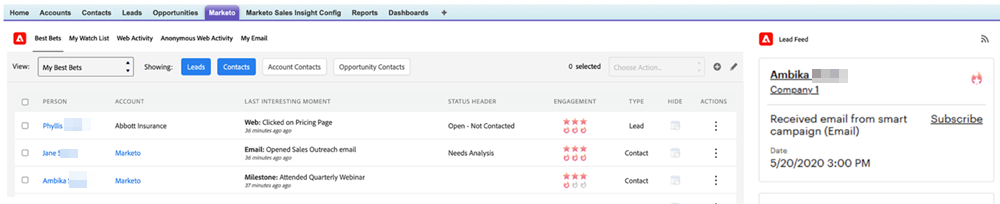

# Verwenden des Lead-Feeds {#using-the-lead-feed}

Der Lead-Feed ist eine aktuelle Liste interessanter Ereignisse, die von Ihren Leads durchgeführt werden. Sie finden sie auf der rechten Seite, wenn Sie auf die Registerkarte Marketo klicken. Es ist wie ein RSS- oder [!DNL Twitter]-Feed - die neuesten Aktualisierungen stehen ganz oben auf der Liste. Benutze dies, um Leads anzustoßen, während du noch frisch in ihren Köpfen bist.

>[!NOTE]
>
>Der Lead-Feed enthält sowohl die Leads, deren Inhaber Sie sind, als auch die Leads in Ihrer Beobachtungsliste.

## Was ist im Lead-Feed enthalten? {#whats-in-the-lead-feed}

Jedes Element im Lead-Feed ist ein interessanter Moment - eine bemerkenswerte Aktivität oder ein Ereignis in der Marketing-Historie dieses Leads.

Beim Anzeigen in [!DNL Salesforce] verfügt jedes Element über:

<table>
 <colgroup>
  <col>
  <col>
 </colgroup>
 <tbody>
  <tr>
   <td>
Element
</td>
   <td>
Beschreibung
</td>
  </tr>
  <tr>
   <td>
A. Lead/Kontakt
</td>
   <td>
Person, die diesen interessanten Moment hatte
</td>
  </tr>
  <tr>
   <td>
B. Ereignistyp
</td>
   <td>
Kategorie für diesen Moment - Web, E-Mail oder Meilenstein
</td>
  </tr>
  <tr>
   <td>
C. Kontoname
</td>
   <td>
Unternehmensname
</td>
  </tr>
  <tr>
   <td>
D. Uhrzeit
</td>
   <td>
Als dieser interessante Moment eintrat
</td>
  </tr>
  <tr>
   <td>
E. Ereignisbeschreibung
</td>
   <td>
Grund für diesen interessanten Moment
</td>
  </tr>
  <tr>
   <td>
F. Abonnieren
</td>
   <td>
E-Mail-Benachrichtigung für Ereignisse wie diese erhalten
</td>
  </tr>
  <tr>
   <td>
G. Stern
</td>
   <td>
Diese Person ist eine Beste Wette (hohe Priorität)
</td>
  </tr>
 </tbody>
</table>

## RSS-Aktualisierungen werden abgerufen {#getting-rss-updates}

Sie können auch Lead-Feed-Updates per RSS-Feed erhalten.  Mit einem RSS-Feed können Sie Aktualisierungen zu Ihren Leads erhalten, auch wenn Sie nicht mit [!DNL Salesforce] verbunden sind. Der Feed hat dieselben Informationen wie der Lead-Feed in [!DNL Salesforce] sowie die folgenden (falls verfügbar):

* E-Mail-Adresse
* Telefonnummer
* Mobiltelefonnummer
* Faxnummer
* Firmenanschrift
* Unternehmens-URL

>[!NOTE]
>
>Der Marketo-Administrator Ihres Unternehmens muss [RSS-Feeds aktivieren](/help/marketo/product-docs/marketo-sales-insight/msi-for-salesforce/features/msi-configuration-tab/enable-rss-for-sales-insight.md) damit dies funktioniert.

Um RSS-Updates zu erhalten, benötigen Sie zwei Dinge: den RSS-Link und einen RSS-Feed-Reader. Sie können den RSS-Link erhalten, indem Sie auf das RSS-Symbol im Lead-Feed klicken:

Der RSS-Feed erscheint in einem neuen Fenster. Sie können dann die URL für Ihren RSS-Feed kopieren und in einem RSS-Reader verwenden. Die meisten Browser verfügen über einen integrierten RSS-Reader oder Sie können einen plattformspezifischen RSS-Reader verwenden.
