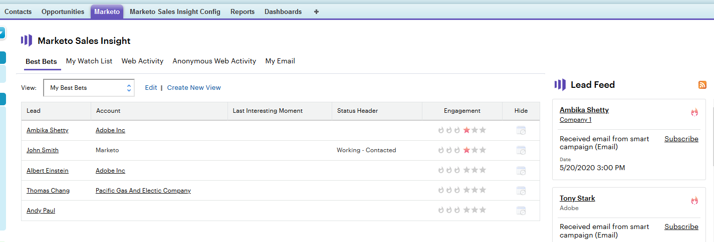

# Verwendung des Interessenten-Feeds {#using-the-lead-feed}

Der Interessentenfeed ist eine aktuelle Liste interessanter Ereignis, die Ihre Interessenten gemacht haben. Sie finden sie auf der rechten Seite, wenn Sie auf die Registerkarte &quot;Markieren&quot;klicken. Es ist wie ein RSS- oder Twitter-Feed - die neuesten Updates stehen oben auf der Liste. Verwenden Sie dies, um auf Interessenten zu springen, solange Sie noch frisch in ihrem Kopf sind.

>[!NOTE]
>
>Der Interessentenfeed enthält sowohl die Interessenten, die Sie besitzen, als auch die Interessenten in Ihrer überwachten Liste.

## Was ist im Interessentenfeed? {#whats-in-the-lead-feed}

\
Jeder Artikel im Interessentenfeed ist ein interessanter Moment - eine bemerkenswerte Aktivität oder ein Ereignis im Marketingverlauf dieses Leads.

Bei der Anzeige in Salesforce verfügt jedes Element über Folgendes:

<table> 
 <colgroup> 
  <col> 
  <col> 
 </colgroup> 
 <tbody> 
  <tr> 
   <td>
Posten
</td> 
   <td>
Beschreibung
</td> 
  </tr> 
  <tr> 
   <td>
A. Interessent/Kontakt
</td> 
   <td>
Person, die diesen interessanten Moment hatte
</td> 
  </tr> 
  <tr> 
   <td>
B. Ereignistyp
</td> 
   <td>
Kategorie für diesen Moment - Web, E-Mail oder Meilenstein
</td> 
  </tr> 
  <tr> 
   <td>
C. Kontoname
</td> 
   <td>
Name der Firma
</td> 
  </tr> 
  <tr> 
   <td>
D. Zeit
</td> 
   <td>
Als dieser interessante Moment auftrat
</td> 
  </tr> 
  <tr> 
   <td>
E. Beschreibung des Ereignisses
</td> 
   <td>
Grund für diesen interessanten Moment
</td> 
  </tr> 
  <tr> 
   <td>
F. Abonnieren
</td> 
   <td>
E-Mail-Benachrichtigung für Ereignis wie diese erhalten
</td> 
  </tr> 
  <tr> 
   <td>
G. Star
</td> 
   <td>
Diese Person ist eine beste Wette (hohe Priorität)
</td> 
  </tr> 
 </tbody> 
</table>

## RSS-Aktualisierungen abrufen {#getting-rss-updates}

Sie können auch Lead-Feed-Aktualisierungen über RSS-Dienste erhalten.  Mit einem RSS-Feed können Sie Aktualisierungen zu Ihren Leads erhalten, auch wenn Sie nicht mit Salesforce verbunden sind. Der Feed enthält dieselben Informationen wie der Interessentenfeed in Salesforce sowie folgende Informationen (falls verfügbar):

* `email address`
* `phone number`
* `mobile number`
* `fax number`
* `company address`
* `company URL`

>[!NOTE]
>
>Der Marketo-Administrator Ihrer Firma muss RSS-Dienste  aktivieren, damit dies funktioniert.

Um RSS-Aktualisierungen zu erhalten, benötigen Sie zwei Dinge: den RSS-Link und einen RSS-Feed-Reader. Sie können den RSS-Link abrufen, indem Sie auf das RSS-Symbol im Interessentenfeed klicken:   

Der RSS-Feed wird in einem neuen Fenster angezeigt. Anschließend können Sie die URL für Ihren RSS-Feed kopieren und in einem RSS-Reader verwenden. Die meisten Browser verfügen über einen integrierten RSS-Reader oder über einen RSS-Reader, der speziell für Ihre Plattform geeignet ist.
