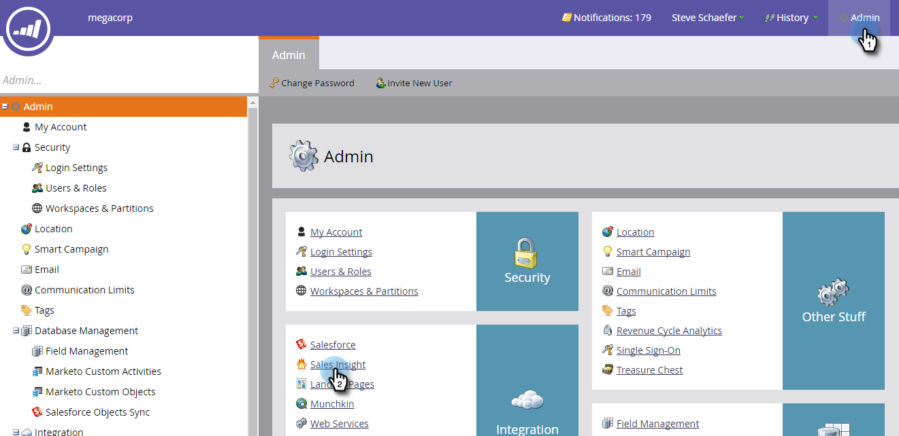
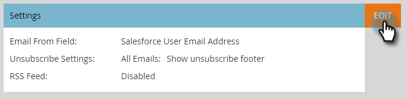

# RSS für Sales Insight aktivieren {#enable-rss-for-sales-insight}

>[!NOTE]
>
>**Erforderliche Administratorberechtigungen**

Wenn Marketo-Benutzer ihren Lead-Feed nicht nur in Salesforce, sondern auch in einem RSS-Feed anzeigen möchten, muss er von einem Marketo-Administrator zuerst aktiviert werden. Es ist einfach.

1. Klicken Sie in My Marketo auf **Admin** und dann auf **Sales Insight**.

   

1. Klicken Sie unter &quot;Einstellungen&quot;auf **Bearbeiten**. Beachten Sie, dass der RSS-Feed als **Deaktiviert** angezeigt wird.

   

1. Aktivieren Sie im Dialogfeld Einstellungen bearbeiten das Kontrollkästchen **RSS-Feed** und klicken Sie auf **Speichern**.

   

   Der RSS-Feed wird jetzt als **Aktiviert** angezeigt.

   

   Kuchen!
