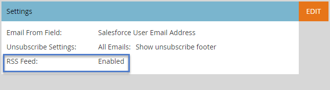

# RSS für [!DNL Sales Insight] aktivieren {#enable-rss-for-sales-insight}

>[!NOTE]
>
>**Admin-Berechtigungen erforderlich**

Wenn Marketo-Benutzer ihren Lead-Feed nicht nur in [!DNL Salesforce], sondern auch in einem RSS-Feed anzeigen möchten, muss ein Marketo-Administrator ihn zuerst aktivieren. Es ist ganz einfach.

1. Klicken Sie in My Marketo auf **[!UICONTROL Admin]** und dann auf **[!DNL Sales Insight]**.

   

1. Klicken Sie in den Einstellungen auf **[!UICONTROL Bearbeiten]**. Beachten Sie, dass der RSS-Feed als &quot;**[!UICONTROL &quot;]**.

   

1. Aktivieren Sie [!UICONTROL &#x200B; Dialogfeld „Einstellungen bearbeiten] das Kontrollkästchen **[!UICONTROL RSS-Feed]** und klicken Sie auf **[!UICONTROL Speichern]**.

   

   Der RSS-Feed wird jetzt als &quot;**[!UICONTROL &quot;]**.

   

   Ein Stück Kuchen!
