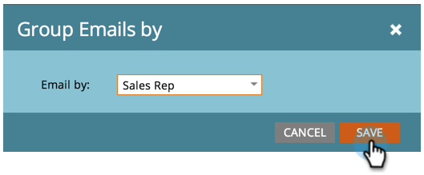

# Sales Insight-E-Mail-Leistungsbericht {#sales-insight-email-performance-report}

Zeigen Sie die Leistung von E-Mails an, die über [!DNL Salesforce], [!DNL Microsoft Dynamics] oder ein Gmail- oder [!DNL Outlook]-Plug-in gesendet werden.

## Erstellen eines Berichts {#generate-a-report}

1. Klicken Sie auf **[!UICONTROL Analytics]**.

   

1. Klicken Sie auf **[!UICONTROL Sales Insight Email Performance]**.

   

1. Klicken Sie auf **[!UICONTROL Setup]** und wählen Sie Ihre gewünschten Werte aus.

   

1. Klicken Sie auf **[!UICONTROL Registerkarte]** Bericht“.

   

   Sehr gut! Jetzt können Sie sehen, wie Ihre E-Mails von Ihrem Verkaufs-Team funktioniert haben.

   >[!NOTE]
   >
   >Der Versandstatus wird nicht für E-Mails erfasst, die über Sales Insight gesendet werden, und wird nicht in diesen Bericht oder in die Aktivitätsprotokolle aufgenommen.

>[!TIP]
>
>Klicken Sie auf den Namen einer E-Mail, um sie in der E-Mail-Vorschau zu öffnen.

## Gruppieren nach [!UICONTROL Vertriebsmitarbeiter] {#group-by-sales-rep}

Sie können diesen Bericht gruppiert nach Vertriebsmitarbeiter anzeigen, indem Sie Ihre Einstellungen ändern.

1. Klicken Sie **[!UICONTROL Setup]**. Doppelklicken Sie auf **[!UICONTROL E-]**.

   

1. Wählen Sie E-Mails gruppieren nach **[!UICONTROL Vertriebsmitarbeiter]**.

   

1. Klicken Sie auf **[!UICONTROL Speichern]**.

   

1. Klicken Sie auf **[!UICONTROL Registerkarte]** Bericht“.

   

   Ziemlich cool, was? Jetzt können Sie die Leistung von E-Mails sehen, die nach Vertriebsmitarbeiter gruppiert sind.
