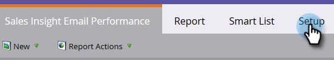

# Sales Insight-E-Mail-Leistungsbericht {#sales-insight-email-performance-report}

Zeigen Sie die Leistung von E-Mails an, die über Salesforce, Microsoft Dynamics oder ein Gmail- oder Outlook-Plug-in gesendet werden.

## Einen Bericht erstellen {#generate-a-report}

1. Klicken Sie auf **Analytics**.

   

1. Klicken Sie auf **Sales Insight Email Performance**.

   

1. Klicken Sie auf die Registerkarte **Setup** und wählen Sie die gewünschten Werte aus.

   

1. Klicken Sie auf die Registerkarte **Bericht** .

   

   Sehr gut! Jetzt können Sie sehen, wie Ihre E-Mails, die von Ihrem Verkaufsteam gesendet wurden, funktionieren.

   >[!NOTE]
   >
   >Der Status Zugestellt wird nicht für E-Mails erfasst, die über Sales Insight gesendet werden, und wird nicht in diesen Bericht oder die Aktivitätsprotokolle aufgenommen.

>[!TIP]
>
>Klicken Sie auf den Namen einer E-Mail, um sie in der E-Mail-Vorschau zu öffnen.

## Gruppe nach Vertriebsmitarbeiter {#group-by-sales-rep}

Sie können diesen Bericht nach Vertriebsmitarbeitern gruppiert anzeigen, indem Sie Ihre Einstellungen ändern.

1. Klicken Sie auf **Einrichten**. Doppelklicken Sie auf **E-Mail**.

   

1. Wählen Sie Gruppe-E-Mails nach **Vertriebsmitarbeiter** aus.

   

1. Klicken Sie auf **Speichern**.

   

1. Klicken Sie auf die Registerkarte **Bericht** .

   

   Sehr cool, was? Jetzt können Sie die Performance von E-Mails nach Vertriebsmitarbeitern gruppieren.
