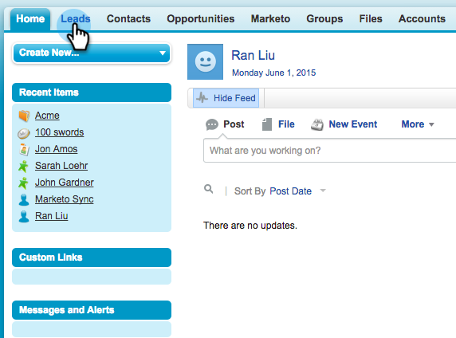

# Senden einer E-Mail an mehrere Datensätze in [!DNL Marketo Sales Insight] {#send-an-email-to-multiple-records-in-marketo-sales-insight}

Es ist sehr einfach, eine Marketo-E-Mail an mehrere Personen zu senden, indem Sie [!DNL Marketo Sales Insight] verwenden. Fangen wir an!

1. Klicken Sie [!DNL Salesforce] auf **[!UICONTROL Leads]** oder **[!UICONTROL Kontakte]**.

   

1. Klicken Sie **[!UICONTROL Los]**, um alle offenen Leads anzuzeigen.

   

1. Markieren Sie in der Listenansicht alle Leads/Kontakte, an die Sie eine E-Mail senden möchten, und klicken Sie auf **[!UICONTROL Marketo-E-Mail senden (klassisch)]**.

   

   >[!NOTE]
   >
   >Wenn Sie [!DNL Salesforce Lightning] verwenden, lautet die Schaltfläche **[!UICONTROL Marketo-E-Mail senden (Blitz)]**.

   >[!TIP]
   >
   >Siehst du den Knopf nicht? Stellen Sie sicher, [&#x200B; Sie die Marketo-Schaltflächen zur Listenansicht hinzugefügt &#x200B;](/help/marketo/product-docs/marketo-sales-insight/msi-for-salesforce/configuration/add-bulk-action-buttons-to-salesforce-classic.md).

1. Erstellen Sie Ihre E-Mail. Klicken Sie **[!UICONTROL Mit Marketo senden]** wenn Sie fertig sind.

   

   >[!TIP]
   >
   >Sie können [E-Mail veröffentlichen in [!DNL Sales Insight]](/help/marketo/product-docs/marketo-sales-insight/msi-for-salesforce/features/actions-in-the-msi-panel/send-marketo-email/publish-an-email-to-sales-insight.md) und aus diesen E-Mails auswählen.

   >[!NOTE]
   >
   >Sie können bis zu 200 Marketo-E-Mails gleichzeitig senden.
