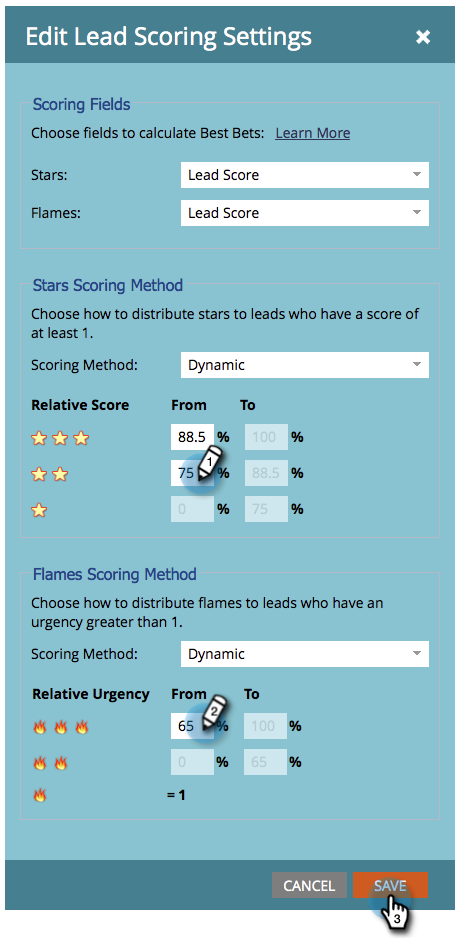

# Anpassen von Sternen und Flammen {#customize-stars-and-flames}

Marketo Sales Insight verwendet Sterne und Flammen, um Leads zu priorisieren. Marketo entscheidet automatisch, wer 1-2-3 Sterne/Flammen erhält. Sie können die Formel jedoch ändern. So geht&#39;s:

>[!AVAILABILITY]
>
>Nicht alle Marketo Engage-Benutzer haben diese Funktion erworben. Weitere Informationen erhalten Sie vom Adobe Account Team (Ihrem Kundenbetreuer).

>[!NOTE]
>
>**Erforderliche Administratorberechtigungen**

1. Klicken Sie unter &quot;Admin&quot;auf **Sales Insight**.

1. Unter dem **Lead-Scoring-Einstellungen** Abschnitt, klicken Sie auf **Bearbeiten**.

   

1. Wählen Sie die **Scoring-Methode** Ihrer Wahl.

   >[!NOTE]
   >
   >**Definition**
   >
   >**Dynamik** - Ist ein aus [relative Daten](/help/marketo/product-docs/marketo-sales-insight/msi-for-salesforce/features/stars-and-flames/priority-urgency-relative-score-and-best-bets.md). Fantastisches Zeug. Diese Methode wird empfohlen.
   >
   >**Statisch** - Ermöglicht die Bestimmung der genauen Punktzahlen - keine Prozentsätze mehr, keine geheimen Saucen mehr.

   

1. Bearbeiten Sie die prozentualen Klammern nach Ihren Vorstellungen und **Speichern**.

   >[!TIP]
   >
   >Bearbeiten Sie einfach den Anfangsprozentsatz, Marketo berechnet den Endprozentsatz für Sie!

   

>[!NOTE]
>
>Sobald Änderungen vorgenommen werden, wird der Prozess der Neuberechnung von Sternen und Flammen einige Zeit in Anspruch nehmen. Geduld ist eine Tugend.

Süße! Sie haben gerade die Art und Weise angepasst, wie Marketo Sterne und Flammen berechnet, um Ihren Geschäftsanforderungen besser gerecht zu werden.
