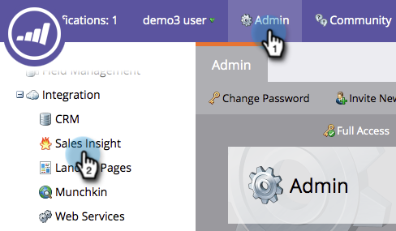
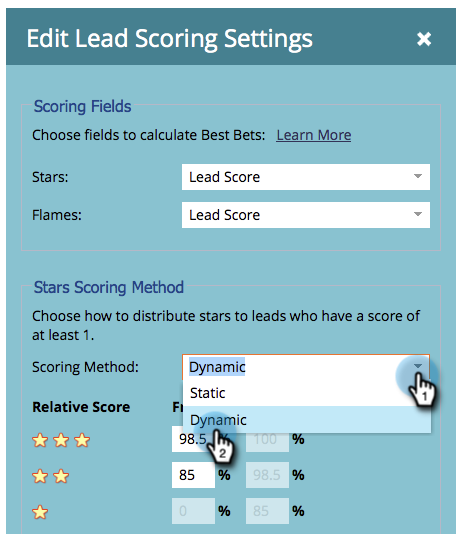
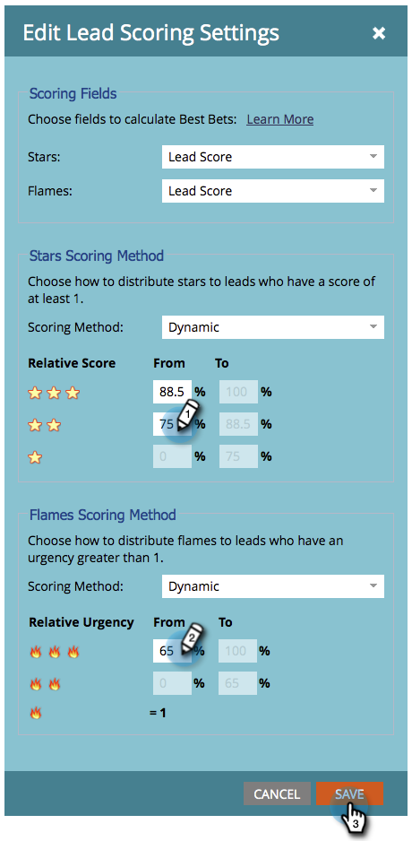

# Anpassen von Sternen und Flammen {#customize-stars-and-flames}

[!DNL Marketo Sales Insight] verwendet Sterne und Flammen, um Leads zu priorisieren. Marketo entscheidet automatisch, wer 1-2-3 Sterne/Flammen erhält. Sie können jedoch die Formel ändern. So geht’s:

>[!AVAILABILITY]
>
>Nicht alle Marketo Engage-Benutzer haben diese Funktion erworben. Weitere Informationen erhalten Sie beim Adobe Account Team (Ihrem Account Manager).

>[!NOTE]
>
>**Admin-Berechtigungen erforderlich**

1. Klicken [!UICONTROL &#x200B; unter &#x200B;] auf **[!UICONTROL Sales Insight]**.

1. Klicken Sie **[!UICONTROL Abschnitt „Lead]** Bewertungseinstellungen“ auf **[!UICONTROL Bearbeiten]**.

   

1. Wählen Sie **[!UICONTROL gewünschte]** aus.

   >[!NOTE]
   >
   >**Definition**
   >
   >**[!UICONTROL Dynamisch]** - Ist ein Prozentwert, der von (relativen [) &#x200B;](/help/marketo/product-docs/marketo-sales-insight/msi-for-salesforce/features/stars-and-flames/priority-urgency-relative-score-and-best-bets.md) abgeleitet wird. Tolle Sachen. Diese Methode wird empfohlen.
   >
   >**[!UICONTROL Static]** - Ermöglicht die Definition exakter Score-Zahlen - keine weiteren Prozentsätze, keine geheimen Sauces mehr.

   

1. Bearbeiten Sie die Prozentklammern nach Belieben und **[!UICONTROL Speichern]**.

   >[!TIP]
   >
   >Bearbeiten Sie einfach den Startprozentsatz. Marketo berechnet dann den Endprozentsatz für Sie!

   

>[!NOTE]
>
>Sobald Änderungen vorgenommen wurden, wird der Prozess der Neuberechnung von Sternen und Flammen einige Zeit dauern. Geduld ist eine Tugend.

Süß! Sie haben die Art und Weise, wie Marketo Sterne und Flammen berechnet, an Ihre Geschäftsanforderungen angepasst.
