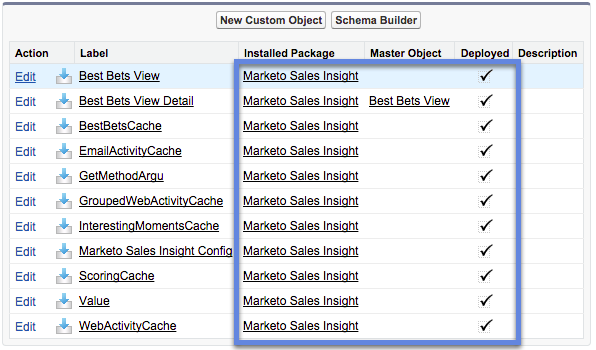

# Installieren des Marketo Sales Insight-Pakets in Salesforce AppExchange {#install-marketo-sales-insight-package-in-salesforce-appexchange}

Sie müssen die Marketo Sales Insight-App in Ihrem Salesforce-Abonnement installieren, bevor Sie alle von Customer Insight bereitgestellten Informationen zu Güte nutzen können. So geht es.

>[!NOTE]
>
>**Erforderliche Administratorberechtigungen**

>[!NOTE]
>
>Marketo Sales Insight ist mit der Verschlüsselung der Salesforce Platform (Shield) kompatibel.

1. Navigieren Sie zu [AppExchange-Seite für Marketo Sales Insight](https://appexchange.salesforce.com/listingDetail?listingId=a0N30000001SVZmEAO) und klicken Sie auf **Jetzt downloaden**.

   

1. Klicken **Bei der AppExchange anmelden** und melden Sie sich mit Ihren Salesforce-Anmeldedaten an.

1. Geben Sie die Anmeldung Ihres verbundenen Salesforce-Kontos ein und klicken Sie auf **Installation in Produktion**.

   

   >[!TIP]
   >
   >Wenn Sie es zuerst in Ihrer Sandbox testen möchten, wählen Sie **Installieren in Sandbox**.

1. Lesen und akzeptieren Sie die Geschäftsbedingungen und klicken Sie auf **Bestätigen und installieren**.

   

1. Sie können &quot;Nur für Administratoren installieren&quot;(und später MSI-Zugriff auf bestimmte Profile gewähren), &quot;Für alle Benutzer installieren&quot;oder &quot;Für bestimmte Profile installieren&quot;auswählen.

   

1. Wenn Sie mit der Installation beginnen, wird möglicherweise die folgende Meldung angezeigt. Sie erhalten eine E-Mail, sobald die Installation abgeschlossen ist. Klicken **Fertig** zu entlassen.

   

1. Stellen Sie sicher, dass **Marketo Sales Insight** befindet sich in den installierten Paketen.

   

1. Klicken **Einrichtung** neben Ihrem Namen.

   

1. Suchen Sie nach &quot;Objekten&quot;und klicken Sie auf **Objekte** under **Erstellen**.

   

1. Überprüfen Sie, ob **Bereitgestellt** für alle Marketo Sales Insight-Artikel überprüft.

   

1. Wenn ein Objekt nicht bereitgestellt wird, klicken Sie auf **Bearbeiten** neben dem Element.

   

1. under **Bereitstellungsstatus** Bereich, wählen Sie **Bereitgestellt** und klicken Sie auf **Speichern**.

   

Großartig gemacht! Jetzt haben Sie Marketo Sales Insight installiert und bereitgestellt. Konfigurieren Sie es für Ihr Verkaufsteam und sehen Sie sich den Verkaufsschub an.

>[!MORELIKETHIS]
>
>* [Konfigurieren von Marketo Sales Insight in Salesforce Professional Edition](/help/marketo/product-docs/marketo-sales-insight/msi-for-salesforce/configuration/configure-marketo-sales-insight-in-salesforce-professional-edition.md)
>* [Konfigurieren von Marketo Sales Insight in Salesforce Enterprise/Unlimited](/help/marketo/product-docs/marketo-sales-insight/msi-for-salesforce/configuration/configure-marketo-sales-insight-in-salesforce-enterprise-unlimited.md)
>* [Einrichten von Sales Insight für Ihr Team](/help/marketo/product-docs/marketo-sales-insight/msi-for-salesforce/configuration/setting-up-sales-insight-for-your-team.md)

