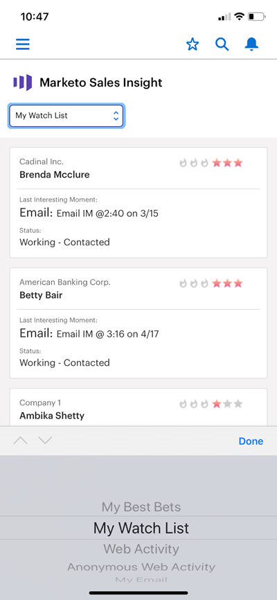

# [!DNL Best Bets] in [!DNL Salesforce1] {#best-bets-in-salesforce}

Ihre [[!DNL Best Bets]](/help/marketo/product-docs/marketo-sales-insight/msi-for-salesforce/features/stars-and-flames/priority-urgency-relative-score-and-best-bets.md) sind Ihre Leads und Kontakte mit der höchsten Dringlichkeit und relativen Punktzahl. Nur die Leads, deren Inhaber Sie sind, sind in dieser Liste sichtbar und die Liste wird aktualisiert, wenn sich die Lead-Bewertungen ändern.

1. Wechseln Sie zum Bereich Marketo in der [!DNL Salesforce] App.

   In der Dropdown-Liste können Sie &quot;[!UICONTROL Meine besten ]&quot;, &quot;[!UICONTROL Meine Watchliste]&quot;, &quot;[!UICONTROL Web-]&quot;, &quot;[!UICONTROL Anonyme Web-Aktivität]&quot; oder &quot;[!UICONTROL Meine E-Mail]&quot; auswählen.

   

>[!MORELIKETHIS]
>
>* [Interessante Momente in [!UICONTROL Salesforce1]](/help/marketo/product-docs/marketo-sales-insight/msi-for-salesforce/msi-for-mobile/interesting-moments-in-salesforce1.md)
>* [Senden von Marketo-E-Mail- und Kampagnen- und Watchlist-Aktionen in [!UICONTROL Salesforce1]](/help/marketo/product-docs/marketo-sales-insight/msi-for-salesforce/msi-for-mobile/send-marketo-email-and-campaign-and-watchlist-actions-in-salesforce1.md)
