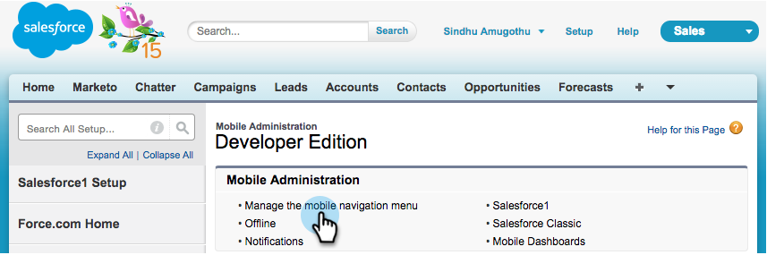

# Installieren und Konfigurieren von Marketo Sales Insight in Salesforce1 {#install-and-configure-marketo-sales-insight-in-salesforce}

>[!NOTE]
>
>Bestehende Kunden, bitte [MSI-Paket aktualisieren](/help/marketo/product-docs/marketo-sales-insight/msi-for-salesforce/upgrading/upgrading-your-msi-package.md) bevor Sie fortfahren!

>[!PREREQUISITES]
>
>Wenn Sie Salesforce Enterprise/Unlimited haben:
>
>* [Schritt 1 von 3: Hinzufügen von Marketo-Feldern zu Salesforce (Enterprise/Unlimited)](/help/marketo/product-docs/crm-sync/salesforce-sync/setup/enterprise-unlimited-edition/step-1-of-3-add-marketo-fields-to-salesforce-enterprise-unlimited.md)
>* [Schritt 2 von 3: Erstellen eines Salesforce-Benutzers für Marketo (Enterprise/Unlimited)](/help/marketo/product-docs/crm-sync/salesforce-sync/setup/enterprise-unlimited-edition/step-2-of-3-create-a-salesforce-user-for-marketo-enterprise-unlimited.md)
>* [Schritt 3 von 3: Verbinden von Marketo und Salesforce (Enterprise/Unlimited)](/help/marketo/product-docs/crm-sync/salesforce-sync/setup/enterprise-unlimited-edition/step-3-of-3-connect-marketo-and-salesforce-enterprise-unlimited.md)
>* [Konfigurieren von Marketo Sales Insight in Salesforce Enterprise/Unlimited](/help/marketo/product-docs/marketo-sales-insight/msi-for-salesforce/configuration/configure-marketo-sales-insight-in-salesforce-enterprise-unlimited.md)
>
>Wenn Sie Salesforce Professional haben:
>
>* [Konfigurieren von Marketo Sales Insight in Salesforce Professional Edition](/help/marketo/product-docs/marketo-sales-insight/msi-for-salesforce/configuration/configure-marketo-sales-insight-in-salesforce-professional-edition.md)
>

>[!NOTE]
>
>Marketo Sales Insight in Salesforce1 umfasst: Best Bets, Lead-Feed, interessante Momente und Add to Marketo Campaign.

## Salesforce1 Mobile App aktivieren {#enable-the-salesforce1-mobile-app}

1. Klicks **Einrichtung** und dann **Mobile Administration**.

   

1. Klicks **Salesforce1**.

   

1. Klicks **Salesforce1-Einstellungen**.

   

1. Klicks **Mobile Browser-App Salesforce1 aktivieren**.

   

1. Klicks **Speichern**.

   

1. Auswählen **Mobile Administration**.

   

1. Klicks **Navigationsmenü für Mobilgeräte verwalten**.

   

1. Auswählen **Marketo** und **Hinzufügen** und **Ausgewählt** Menüeinträgen.

   

1. Auswählen **Marketo**, verschieben **up** zu einem gewünschten Bereich hinzu und klicken Sie auf **Speichern**.

   

## Veraltetes benutzerdefiniertes Marketo-Objekt ausblenden {#hide-outdated-marketo-custom-object}

1. Klicks **Einrichtung**.

   

1. Auswählen **Benutzer verwalten**.

   

1. Auswählen **Profile**.

   

1. Klicken Sie auf **edit** alle gewünschten Profile.

   

1. under **Registerkarteneinstellungen**, wählen Sie die _first_ **Marketo**.

   

1. Auswählen **Registerkarte ausgeblendet**.

   

   >[!NOTE]
   >
   >Vergewissern Sie sich, dass die Registerkarte Marketo für alle gewünschten Profile ausgeblendet wird!

## Anpassen von Registerkarten {#customize-tabs}

1. Klicken **+**.

   

1. Klicks **Benutzerdefinierte Registerkarten**.

   

1. Auswählen **Marketo** und **Hinzufügen** auf die ausgewählten Registerkarten.

   

1. Auswählen **Marketo**, verschieben **up** zu einem gewünschten Bereich hinzu und klicken Sie auf **Speichern**.

   

## Seitenlayouts anpassen {#customize-page-layouts}

1. Klicks **Einrichtung**.

   

1. Klicks **Einrichtung**, Typ **Seitenlayouts** und klicken Sie auf **Seitenlayouts** unter &quot;Leads&quot;.

   >[!NOTE]
   >
   >Wiederholen Sie die Schritte für jedes Seitenlayout, das Ihr Unternehmen verwendet (Marketing, Vertrieb usw.). für Kontakt-, Konto- und Opportunity-Objekte.

   

1. Klicks **Bearbeiten** , um Änderungen am Lead-Layout vorzunehmen.

   

1. Klicks **Visualforce-Seiten** und ziehen Sie **Lead Mobile** in den Bereich Karten für Mobilgeräte .

   

1. Ändern Sie die Höhe in 66 und klicken Sie auf **OK**.

   

1. Klicks **Felder** und ziehen **Zu Marketo Campaign hinzufügen** der **Marketo Sales Insight** Abschnitt.

   

   >[!TIP]
   >
   >Geben Sie &quot;Hinzufügen zu&quot;in die Schnellsuche ein, um die Suche nach Hinzufügen zu Marketo Campaign zu vereinfachen.

1. Klicks **Speichern**.

   

Phew! Sie haben die Installation von Marketo Sales Insight für Salesforce1 abgeschlossen! Mach weiter und gib dir einen PFAD auf den Rücken.

>[!MORELIKETHIS]
>
>* [Beste Betten in Salesforce1](/help/marketo/product-docs/marketo-sales-insight/msi-for-salesforce/msi-for-mobile/best-bets-in-salesforce1.md)
>* [Interessante Momente in Salesforce1](/help/marketo/product-docs/marketo-sales-insight/msi-for-salesforce/msi-for-mobile/interesting-moments-in-salesforce1.md)
>* [Senden von Marketo-E-Mail- und -Campaign- und Watchlist-Aktionen in Salesforce1](/help/marketo/product-docs/marketo-sales-insight/msi-for-salesforce/msi-for-mobile/send-marketo-email-and-campaign-and-watchlist-actions-in-salesforce1.md)
