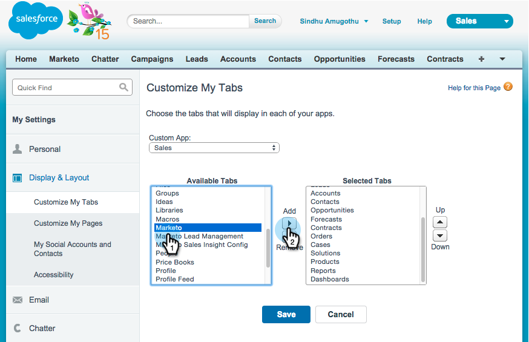

# Installieren und Konfigurieren von Marketo Sales Insight in Salesforce1 {#install-and-configure-marketo-sales-insight-in-salesforce}

>[!NOTE]
>
>**Erinnerung**
>
>Bestehende Kunden, bitte [Upgrade Ihres MSI-Pakets](http://docs.marketo.com/x/_gU6Ag), bevor Sie fortfahren!

>[!PREREQUISITES]
>
>Wenn Sie Salesforce Enterprise/Unlimited haben:
>
>* [Schritt 1 von 3: hinzufügen Marketo-Felder an Salesforce (Enterprise/Unlimited)](../../../../product-docs/crm-sync/salesforce-sync/setup/enterprise-unlimited-edition/step-1-of-3-add-marketo-fields-to-salesforce-enterprise-unlimited.md)
>* [Schritt 2 von 3: Erstellen eines Salesforce-Benutzers für Marketing (Enterprise/Unlimited)](../../../../product-docs/crm-sync/salesforce-sync/setup/enterprise-unlimited-edition/step-2-of-3-create-a-salesforce-user-for-marketo-enterprise-unlimited.md)
>* [Schritt 3 von 3: Connect Marketing und Salesforce (Enterprise/Unlimited)](../../../../product-docs/crm-sync/salesforce-sync/setup/enterprise-unlimited-edition/step-3-of-3-connect-marketo-and-salesforce-enterprise-unlimited.md)
>* [Konfigurieren von MarketingTo Sales Insight in Salesforce Enterprise/Unlimited](../../../../product-docs/marketo-sales-insight/msi-for-salesforce/configuration/configure-marketo-sales-insight-in-salesforce-enterprise-unlimited.md)

>
>
Wenn Sie Salesforce Professional haben:
>
>* [Konfigurieren von Marketo Sales Insight in Salesforce Professional Edition](../../../../product-docs/marketo-sales-insight/msi-for-salesforce/configuration/configure-marketo-sales-insight-in-salesforce-professional-edition.md)

>

>[!NOTE]
>
>Marketo Sales Insight in Salesforce1 beinhaltet: Beste Wetten, Interessentenfeed, interessante Momente und Hinzufügen zur Kampagne von Marketo.

1. Salesforce1 Mobile-App aktivieren
1. Klicken Sie auf **Setup** und dann **Mobile Administration**.

   

1. Klicken Sie auf **Salesforce1**.

   

1. Klicken Sie auf **Salesforce1 Settings**.

   

1. Klicken Sie auf **Aktivieren Sie die mobile Browser-App Salesforce1**.

   

1. Klicken Sie auf **Speichern**.

   

1. Wählen Sie **Mobile Administration**.

   

1. Klicken Sie auf **Mobiles Navigationsmenü verwalten**.

   

1. Wählen Sie **Marketo **und **Hinzufügen **it zu den **Ausgewählte **Menüpunkten.

   

1. Wählen Sie **Marketo**, verschieben Sie es **Nach oben **nach oben in einen gewünschten Bereich und klicken Sie auf **Speichern**.

   

1. Veraltete Marke zu benutzerdefiniertem Objekt ausblenden
1. Klicken Sie auf **Setup**.

   

1. Wählen Sie **Benutzer verwalten**.

   

1. Wählen Sie **Profil**.

   

1. Klicken Sie auf **Bearbeiten **alle gewünschten Profil.

   

1. Wählen Sie unter **Tab-Einstellungen** *first* **Marketo**.

   ** 

   **

1. Wählen Sie **Ausgeblendetes Register**.

   ** 

   **

   >[!NOTE]
   >
   >Achten Sie darauf, die Registerkarte Marketo für alle gewünschten Profil auszublenden!

1. Anpassen von Registerkarten
1. Klicken Sie auf** +**.

   

1. Klicken Sie auf **Meine Registerkarten anpassen**.

   

1. Wählen Sie **Marketo** und **Hinzufügen **it auf den ausgewählten Registerkarten aus.

   

1. Wählen Sie **Marketo**, verschieben Sie es **Nach oben **nach oben in einen gewünschten Bereich und klicken Sie auf **Speichern**.

   

1. Seitenlayouts anpassen
1. Klicken Sie auf **Setup**.

   

1. Klicken Sie auf **Setup**, geben Sie **Seitenlayouts** ein und klicken Sie unter &quot;Interessenten&quot;auf **Seitenlayouts**.

   >[!NOTE]
   >
   >Wiederholen Sie die Schritte für jedes Seitenlayout, das Ihr Unternehmen verwendet (Marketing, Vertrieb usw.). für Kontakt-, Konto- und Opportunity-Objekte.

   

1. Klicken Sie auf **Bearbeiten**, um Änderungen am Interessentenlayout vorzunehmen.

   

1. Klicken Sie auf **Visualforce-Seiten **und ziehen Sie dann** Lead Mobile **in den Bereich &quot;Mobilkarten&quot;.

   

1. Ändern Sie die Höhe in 66 und klicken Sie auf **OK**.

   

1. Klicken Sie auf **Felder** und ziehen Sie **Hinzufügen auf Marketo-Kampagne **in den Abschnitt** Marketo Sales Insight **Abschnitt.

   

   >[!TIP]
   >
   >Geben Sie &quot;Hinzufügen zu&quot;in die Schnellsuche ein, um die Hinzufügen zur Kampagne von Marketo leicht zu finden.

1. Klicken Sie auf **Speichern**.

   

Phew! Sie sind endlich fertig mit der Installation von Marketo Sales Insight für Salesforce1! Geh voraus und gib dir einen Pat auf die Rückseite.

>[!NOTE]
>
>**Verwandte Artikel**
>
>* [Beste Einsätze in Salesforce1](best-bets-in-salesforce1.md)
>* [Interessante Momente in Salesforce1](interesting-moments-in-salesforce1.md)
>* [Senden von E-Mail-Nachrichten und Kampagnen- und Watchlist-Aktionen in Salesforce1](send-marketo-email-and-campaign-and-watchlist-actions-in-salesforce1.md)

>

