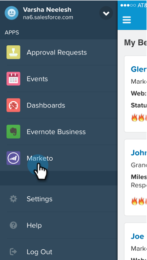
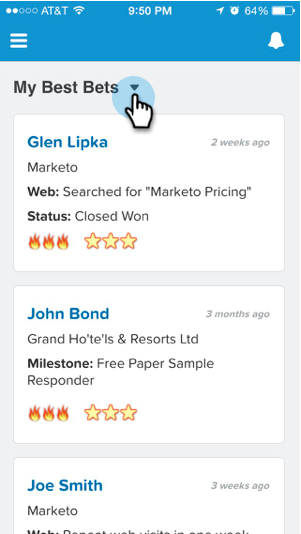
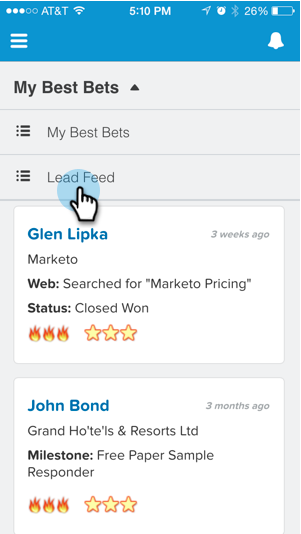

# Anzeigen des Lead-Feeds in [!DNL Salesforce1] {#seeing-lead-feed-in-salesforce}

Der Lead-Feed ist eine aktuelle Liste interessanter Ereignisse, die von Ihren Leads durchgeführt werden.

1. Wechseln Sie zum Bereich **Marketo** in [!DNL Salesforce1].

   

1. Tippen Sie auf den Abwärtspfeil.

   

1. Tippen Sie auf **[!UICONTROL Lead-Feed]**.

   

   Perfekt! Jetzt wissen Sie, wie Sie zu Ihrem Lead-Feed gelangen!

   

>[!MORELIKETHIS]
>
>* [Interessante Momente in [!DNL Salesforce1]](/help/marketo/product-docs/marketo-sales-insight/msi-for-salesforce/msi-for-mobile/interesting-moments-in-salesforce1.md)
>* [Senden von Marketo-E-Mail- und Kampagnen- und Watchlist-Aktionen in [!DNL Salesforce1]](/help/marketo/product-docs/marketo-sales-insight/msi-for-salesforce/msi-for-mobile/send-marketo-email-and-campaign-and-watchlist-actions-in-salesforce1.md)
>* [[!DNL Best Bets] in [!DNL Salesforce1]](/help/marketo/product-docs/marketo-sales-insight/msi-for-salesforce/msi-for-mobile/best-bets-in-salesforce1.md)
