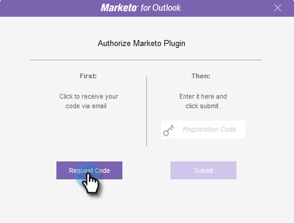

# Marketo [!DNL Outlook]-Plug-in autorisieren {#authorize-the-marketo-outlook-plugin}

Um das Marketo MSI-Plug-in [!DNL Outlook] verwenden zu können, müssen Sie es autorisieren.

>[!PREREQUISITES]
>
>Das Plug-in muss bereits installiert sein und Sie müssen von Ihrem Marketo-Administrator als Plug-in-Benutzer autorisiert worden sein.

>[!IMPORTANT]
>
>Microsoft hat eine [neue Version von Outlook für Windows](https://techcommunity.microsoft.com/t5/outlook-blog/new-outlook-for-windows-now-available/ba-p/3932068){target="_blank"} veröffentlicht. Diese neue Version unterstützt nicht das vorhandene MSI Outlook-Plug-in. Das MSI Outlook-Plug-in funktioniert weiterhin für Windows-Desktops, auf denen die klassische Version von Outlook ausgeführt wird. Weitere Informationen zum neuen Outlook für Windows für Unternehmen finden Sie ([ Sie hier](https://techcommunity.microsoft.com/t5/outlook-blog/the-new-outlook-for-windows-for-organization-admins/ba-p/3929169){target="_blank"}.

1. Klicken Sie auf eine der Marketo-Nachrichtenschaltflächen.

   

1. Wenn das Dialogfeld [!UICONTROL Marketo-Plug] autorisieren angezeigt wird, klicken Sie auf **[!UICONTROL Code anfordern]**.

   

1. Der Code wird an die standardmäßige E-Mail-Adresse Ihres [!DNL Outlook]-Kontos gesendet.

   

1. Wenn sich Ihre standardmäßige E-Mail-Adresse für das [!DNL Outlook]-Konto meldet, erhalten Sie einen Registrierungsschlüssel. Geben Sie es in das Popup-Fenster ein und klicken Sie auf **[!UICONTROL Senden]**.

   

   >[!NOTE]
   >
   >Der Registrierungs-Code **läuft nach 14 Tagen ab.**

1. Wenn die E-Mail-Adresse nicht autorisiert ist, erhalten Sie diese weniger freudige E-Mail. Wenden Sie sich an Ihren Marketo-Administrator, um das Problem zu beheben.

   
