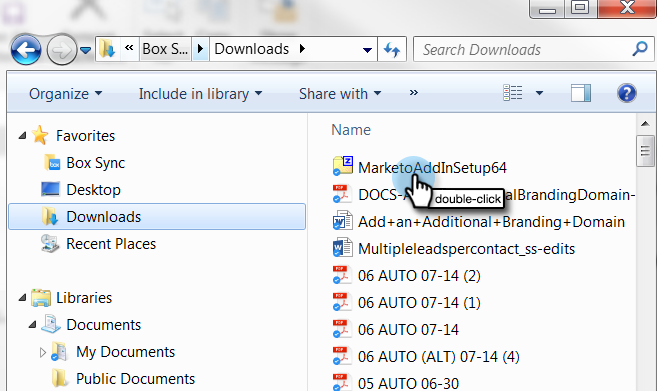

# Installieren des Marketo E-Mail-Add-ins für Outlook mit Registrierungs-Code {#install-the-marketo-email-add-in-for-outlook-with-a-registration-code}

Wenn Benutzer auf die Admin-Einstellungen auf ihren Laptops zugreifen können, können Sie ihnen direkt einen Registrierungs-Code senden.

Wenn Sie keine Einladungs-E-Mail erhalten haben, bitten Sie Ihren Marketo-Administrator, Sie einzuladen.

>[!PREREQUISITES]
>
>Es muss [eine Marketo E-Mail-Add-In-Lizenz ](/help/marketo/product-docs/marketo-sales-insight/msi-outlook-plugin/issue-a-marketo-email-add-in-license.md).

>[!IMPORTANT]
>
>Die Installation wird nicht auf PCs unterstützt, auf denen der Windows-Benutzerordner nicht englische Zeichen enthält. Dieser Ordner wird automatisch von Windows unter `<System Root>\Users\` basierend auf dem Windows-Benutzernamen generiert und kann nicht englische Zeichen enthalten, wenn der Windows-Benutzername ein nicht englischer Name ist. Bitte wenden Sie sich an Ihr IT-Team, um zu überprüfen, ob Installationsprobleme auftreten.

>[!NOTE]
>
>Die Aktionsfunktionen von Sales Insight, einschließlich „Verkaufs-E-Mail senden“, „Zu Verkaufskampagne hinzufügen“ und „Aufgaben“, sind in den E-Mail-Plug-ins von Sales Insight für Gmail und Outlook nicht verfügbar. Derzeit haben Benutzer nur die Möglichkeit, über ihren E-Mail-Client eine verfolgbare E-Mail mit oder ohne Marketo-E-Mail-Vorlage zu senden, wenn sie die E-Mail-Plug-ins für Sales Insight verwenden.

## Installationsprogramm herunterladen {#download-installer}

1. Identifizieren Sie Ihre [Microsoft Outlook-Version](https://support.office.com/en-us/article/what-version-of-outlook-do-i-have-b3a9568c-edb5-42b9-9825-d48d82b2257c){target="_blank"}.

1. Klicken Sie in der folgenden Tabelle auf den Link, um die entsprechende ZIP-Datei für Ihre Version von Microsoft Outlook herunterzuladen.

1. Entpacken Sie die Datei, um auf die erforderliche MSI-Datei zuzugreifen, und fahren Sie mit der Installation fort.

   >[!NOTE]
   >
   >Derzeit funktionieren die unten stehenden Links nur in Microsoft Edge oder durch Rechtsklick in Chrome. Entschuldigung für eventuelle Unannehmlichkeiten.

<table><thead>
  <tr>
    <th>Outlook-Version</th>
    <th>32-Bit-Outlook</th>
    <th>64-Bit-Outlook</th>
  </tr></thead>
<tbody>
  <tr>
    <td>Outlook 2000</td>
    <td>Nicht unterstützt</td>
    <td>Nicht zutreffend</td>
  </tr>
  <tr>
    <td>Outlook 2003</td>
    <td><a href="https://munchkin.marketo.net/MarketoAddInSetup32.zip">Download</a></td>
    <td>Nicht zutreffend</td>
  </tr>
  <tr>
    <td>Outlook 2007</td>
    <td><a href="https://munchkin.marketo.net/MarketoAddInSetup32.zip">Download</a></td>
    <td>Nicht zutreffend</td>
  </tr>
  <tr>
    <td>Outlook 2010</td>
    <td><a href="https://munchkin.marketo.net/MarketoAddInSetup32.zip">Download</a></td>
    <td><a href="https://munchkin.marketo.net/MarketoAddInSetup64.zip">Download</a></td>
  </tr>
  <tr>
    <td>Outlook 2013</td>
    <td><a href="https://munchkin.marketo.net/MarketoAddInSetup32.zip">Download</a></td>
    <td><a href="https://munchkin.marketo.net/MarketoAddInSetup64.zip">Download</a></td>
  </tr>
  <tr>
    <td>Outlook 2016</td>
    <td><a href="https://munchkin.marketo.net/MarketoAddInSetup32.zip">Download</a></td>
    <td><a href="https://munchkin.marketo.net/MarketoAddInSetup64.zip">Download</a></td>
  </tr>
  <tr>
    <td>Outlook 2019</td>
    <td><a href="https://munchkin.marketo.net/MarketoAddInSetup32.zip">Download</a></td>
    <td><a href="https://munchkin.marketo.net/MarketoAddInSetup64.zip">Download</a></td>
  </tr>
  <tr>
    <td>Outlook für Mac</td>
    <td>Nicht unterstützt</td>
    <td>Nicht unterstützt</td>
  </tr>
  <tr>
    <td>Outlook Web App</td>
    <td>Nicht unterstützt</td>
    <td>Nicht unterstützt</td>
  </tr>
  <tr>
    <td>Office 365*</td>
    <td><a href="https://munchkin.marketo.net/MarketoAddInSetup32.zip">Download</a></td>
    <td><a href="https://munchkin.marketo.net/MarketoAddInSetup64.zip">Download</a></td>
  </tr>
</tbody></table>

*Office 365-Version: Nur Windows-Client (unter Windows 10, Enterprise oder Pro).

>[!IMPORTANT]
>
>Microsoft hat eine [neue Version von Outlook für Windows](https://techcommunity.microsoft.com/t5/outlook-blog/new-outlook-for-windows-now-available/ba-p/3932068){target="_blank"} veröffentlicht. Diese neue Version unterstützt nicht das vorhandene MSI Outlook-Plug-in. Das MSI Outlook-Plug-in funktioniert weiterhin für Windows-Desktops, auf denen die klassische Version von Outlook ausgeführt wird. Weitere Informationen zum neuen Outlook für Windows für Unternehmen finden Sie ([ Sie hier](https://techcommunity.microsoft.com/t5/outlook-blog/the-new-outlook-for-windows-for-organization-admins/ba-p/3929169){target="_blank"}.

## Registrierungs-Code kopieren {#copy-your-registration-code}

1. Kopieren Sie den Registrierungs-Code aus der Einladungs-E-Mail, die Sie erhalten haben.

   

1. Schließen Sie Microsoft Outlook.

   

## Installieren {#install}

1. Führen Sie das Installationsprogramm aus.

   

   >[!NOTE]
   >
   >Wenn Sie eine Sicherheitswarnung erhalten, machen Sie sich keine Sorgen! Klicken Sie einfach **Ausführen**.

1. Klicken Sie auf **Weiter**.

   

1. Füllen Sie **Vorname**, **Nachname**, **E-Mail-Adresse** aus, kopieren Sie dann den **Registrierungs-Code** aus der E-Mail in das Formular und klicken Sie auf **Weiter**.

   

   >[!TIP]
   >
   >Wenn die Installation fehlschlägt, wenden Sie sich an Ihre IT-Abteilung, um sicherzustellen, dass der HTTPS-Traffic nicht blockiert wird. Für das Installationsprogramm muss HTTPS-Traffic geöffnet sein.

1. Klicken Sie **Weiter**, um die Installation am Standardspeicherort durchzuführen.

   

1. Klicken Sie auf **Weiter**.

   

   >[!NOTE]
   >
   >Wenn Sie eine Sicherheitsaufforderung zu einem unbekannten Herausgeber erhalten, klicken Sie auf **Ja**.

1. Die Installation ist nun abgeschlossen. Klicken Sie auf **Schließen**.

   

1. Öffnen Sie jetzt Microsoft Outlook und sehen Sie sich die Marketo-Schaltflächen an.

   

   Ausgezeichnet! Jetzt sind die Marketo-Schaltflächen besser platziert.

Erfahren Sie mehr über die Verwendung der Aktionen &quot;Marketo-Nachricht“ und „Mit Marketo protokollieren“.

>[!MORELIKETHIS]
>
>* [Senden und Verfolgen einer E-Mail mit dem Marketo E-Mail-Add-in für Outlook](/help/marketo/product-docs/marketo-sales-insight/msi-outlook-plugin/send-and-track-an-email-with-the-email-add-in-for-outlook.md){target="_blank"}
>* [Senden und Verfolgen aus Outlook mithilfe einer Marketo-Vorlage](/help/marketo/product-docs/marketo-sales-insight/msi-outlook-plugin/send-and-track-from-outlook-using-a-marketo-template.md){target="_blank"}
