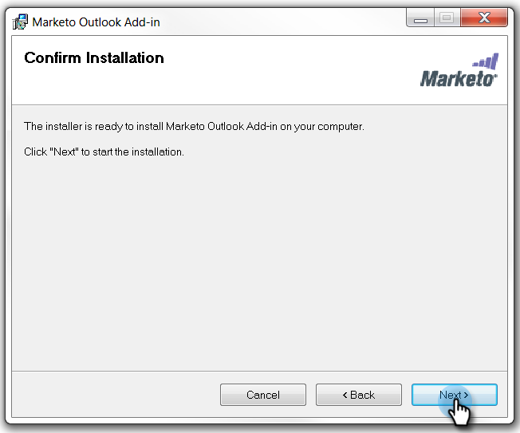

# Installieren des Marketo-E-Mail-Add-ins für Outlook mit einem Registrierungs-Code {#install-the-marketo-email-add-in-for-outlook-with-a-registration-code}

Wenn Benutzer auf die Admin-Einstellungen auf ihren Laptops zugreifen können, können Sie ihnen direkt einen Registrierungs-Code senden.

Wenn Sie keine Einladungs-E-Mail erhalten haben, bitten Sie Ihren Marketo-Administrator, Sie einzuladen.

>[!PREREQUISITES]
>
>Du musst sein [hat eine Marketo Email Add-In-Lizenz ausgestellt](/help/marketo/product-docs/marketo-sales-insight/msi-outlook-plugin/issue-a-marketo-email-add-in-license.md).

>[!IMPORTANT]
>
>Die Installation wird nicht auf PCs unterstützt, auf denen der Ordner Windows-Benutzer nicht englische Zeichen enthält. Dieser Ordner wird automatisch von Windows unter `<System Root>\Users\` basierend auf dem Windows-Benutzernamen und kann nicht englische Zeichen enthalten, wenn der Windows-Benutzername ein nicht englischer Name ist. Wenden Sie sich an Ihr IT-Team, um festzustellen, ob bei der Installation Probleme auftreten.

>[!NOTE]
>
>Die Funktionen von Sales Insight-Aktionen, einschließlich &quot;E-Mail an Vertrieb senden&quot;, &quot;Zu Vertriebskampagne hinzufügen&quot;und &quot;Aufgaben&quot;, sind nicht in den Sales Insight-E-Mail-Plugins für Gmail und Outlook verfügbar. Derzeit können Benutzer von ihrem E-Mail-Client aus nur trackbare E-Mails mit oder ohne Marketo-E-Mail-Vorlage senden, wenn sie die Sales Insight-E-Mail-Plugins verwenden.

## Installationsprogramm herunterladen {#download-installer}

1. Identifizieren Ihrer [Microsoft Outlook-Version](https://support.office.com/en-us/article/what-version-of-outlook-do-i-have-b3a9568c-edb5-42b9-9825-d48d82b2257c){target="_blank"}

1. Klicken Sie auf den Link, um das Installationsprogramm herunterzuladen, das für Ihre Version von Microsoft Outlook geeignet ist.

   >[!NOTE]
   >
   >Derzeit funktionieren die folgenden Links nur in Microsoft Edge oder durch Rechtsklick in Chrome. Entschuldigung für eventuelle Unannehmlichkeiten.

   | Outlook-Version | 32-Bit-Outlook | 64-Bit-Outlook |
   |---|---|---|
   | Outlook 2000 | Nicht unterstützt | n.z |
   | Outlook 2003 | [Download](https://munchkin.marketo.net/MarketoAddInSetup32.msi) | n.z |
   | Outlook 2007 | [Download](https://munchkin.marketo.net/MarketoAddInSetup32.msi) | n.z |
   | Outlook 2010 | [Download](https://munchkin.marketo.net/MarketoAddInSetup32.msi) | [Download](https://munchkin.marketo.net/MarketoAddInSetup64.msi) |
   | Outlook 2013 | [Download](https://munchkin.marketo.net/MarketoAddInSetup32.msi) | [Download](https://munchkin.marketo.net/MarketoAddInSetup64.msi) |
   | Outlook 2016 | [Download](https://munchkin.marketo.net/MarketoAddInSetup32.msi) | [Download](https://munchkin.marketo.net/MarketoAddInSetup64.msi) |
   | Outlook 2019 | [Download](https://munchkin.marketo.net/MarketoAddInSetup32.msi) | [Download](https://munchkin.marketo.net/MarketoAddInSetup64.msi) |
   | Outlook für Mac | Nicht unterstützt | Nicht unterstützt |
   | Outlook Web App | Nicht unterstützt | Nicht unterstützt |
   | Office 365* | [Download](https://munchkin.marketo.net/MarketoAddInSetup32.msi) | [Download](https://munchkin.marketo.net/MarketoAddInSetup64.msi) |

   *Office 365-Version: Nur Windows-Client (unter Windows 10, Enterprise oder Pro).

## Registrierungscode kopieren {#copy-your-registration-code}

1. Kopieren Sie den Registrierungscode aus der Einladungs-E-Mail, die Sie erhalten haben.

   

1. Schließen Sie Microsoft Outlook.

   

## Installieren {#install}

1. Führen Sie das Installationsprogramm aus.

   

   >[!NOTE]
   >
   >Wenn du eine Sicherheitswarnung bekommst, mach dir keine Sorgen! Klicken Sie einfach auf **Ausführen**.

1. Klicks **Nächste**.

   

1. Ausfüllen **Vorname**, **Nachname**, **Email-Adresse**, kopieren und fügen Sie die **Registrierungs-Code** aus der E-Mail in das Formular und klicken Sie auf **Nächste**.

   

   >[!TIP]
   >
   >Wenn die Installation fehlschlägt, wenden Sie sich an Ihre IT-Abteilung, um sicherzustellen, dass der HTTPS-Traffic nicht blockiert wird. Für das Installationsprogramm muss HTTPS-Traffic geöffnet sein.

1. Klicks **Nächste** , um die Installation am Standardspeicherort durchzuführen.

   

1. Klicks **Nächste**.

   

   >[!NOTE]
   >
   >Wenn Sie eine Sicherheitsaufforderung bezüglich eines unbekannten Herausgebers erhalten, klicken Sie auf **Ja**.

1. Die Installation ist jetzt abgeschlossen. Klicken Sie auf **Schließen**.

   

1. Öffnen Sie jetzt Microsoft Outlook und sehen Sie sich die Marketo-Schaltflächen an.

   

   Ausgezeichnet! Jetzt sind die Marketo-Schaltflächen an einem besseren Ort.

Erfahren Sie mehr über die Verwendung der Aktionen &quot;Marketo Message&quot;und &quot;Log With Marketo&quot;.

>[!MORELIKETHIS]
>
>* [Senden und Verfolgen einer E-Mail mit dem Marketo E-Mail-Add-in für Outlook](/help/marketo/product-docs/marketo-sales-insight/msi-outlook-plugin/send-and-track-an-email-with-the-email-add-in-for-outlook.md){target="_blank"}
>* [Senden und Verfolgen aus Outlook mit einer Marketo-Vorlage](/help/marketo/product-docs/marketo-sales-insight/msi-outlook-plugin/send-and-track-from-outlook-using-a-marketo-template.md){target="_blank"}
