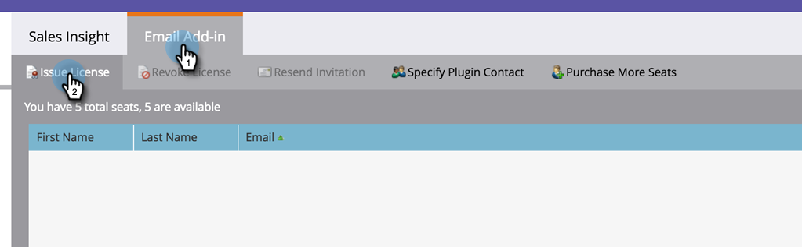

# Bereitstellen einer Marketo-E-Mail-Add-In-Lizenz {#issue-a-marketo-email-add-in-license}

Jeder, der das Marketo Email Outlook Add-In verwenden möchte, muss zunächst eine Lizenz erhalten. Es gibt zwei Möglichkeiten, die Lizenz bereitzustellen.

* **[Installation von Unternehmensschlüsseln](/help/marketo/product-docs/marketo-sales-insight/msi-outlook-plugin/install-the-marketo-add-in-for-outlook-with-an-enterprise-key.md)**: Verwenden Sie diese Methode, wenn die Vertriebsmitarbeiter keine Administratorrechte für ihre Unternehmens-Laptops haben und keine Plug-ins, Software usw. installieren können. darauf ein. In diesem Fall erteilt der Marketo-Administrator Lizenzen für eine Liste autorisierter Benutzer. Anschließend stellt das IT-Team das Plug-in mithilfe des Enterprise-Schlüssels remote auf den Computern autorisierter Benutzer bereit. Der Plug-in-Benutzer autorisiert es dann.
* **[Installation des Registrierungs-Codes](/help/marketo/product-docs/marketo-sales-insight/msi-outlook-plugin/install-the-marketo-email-add-in-for-outlook-with-a-registration-code.md)**: Verwenden Sie diese Methode, wenn Vertriebsmitarbeiter über Administratorrechte für ihren Unternehmens-Laptop verfügen und Plugins, Software usw. installieren können. darauf ein. Zu diesem Zweck erteilt der Marketo-Administrator Lizenzen an eine Liste autorisierter Benutzer und sendet ihnen Registrierungs-E-Mails direkt mit Downloadlinks. Der Vertriebsmitarbeiter erhält eine E-Mail mit einem Plugin-Downloadlink und einer eindeutigen Registrierungs-URL.

>[!AVAILABILITY]
>
>Nicht alle Marketo Engage-Benutzer haben diese Funktion erworben. Weitere Informationen erhalten Sie vom Adobe Account Team (Ihrem Kundenbetreuer).

>[!NOTE]
>
>**Erforderliche Administratorberechtigungen**

1. Klicken Sie in My Marketo auf Admin und dann auf Sales Insight.

1. Unter dem **E-Mail-Add-in** Registerkarte, klicken **Ausstelllizenz**.

   

1. Geben Sie die E-Mail-Adressen der Vertriebsmitarbeiter ein, die zur Verwendung des Plug-ins autorisiert werden müssen, und klicken Sie auf **Ausstelllizenz**.

   >

   >[!TIP]
   >
   >Sie können mehrere E-Mail-Adressen eingeben, getrennt durch Kommas.

   >[!NOTE]
   >
   >Um das Plug-in remote zu installieren, lassen Sie das Kontrollkästchen deaktiviert und senden Sie Ihrem IT-Team Ihre [Enterprise Key](/help/marketo/product-docs/marketo-sales-insight/msi-outlook-plugin/install-the-marketo-add-in-for-outlook-with-an-enterprise-key.md).
   >
   >Wenn Ihre Vertriebsmitarbeiter Administratorzugriff auf ihre Computer haben, aktivieren Sie das Kontrollkästchen und Sie sind fertig!

>[!MORELIKETHIS]
>
>* [Installieren des Marketo-Add-ins für Outlook mit einem Unternehmensschlüssel](/help/marketo/product-docs/marketo-sales-insight/msi-outlook-plugin/install-the-marketo-add-in-for-outlook-with-an-enterprise-key.md)
>* [Installieren des Marketo-E-Mail-Add-ins für Outlook mit einem Registrierungs-Code](/help/marketo/product-docs/marketo-sales-insight/msi-outlook-plugin/install-the-marketo-email-add-in-for-outlook-with-a-registration-code.md)
>* [Upgrade Ihres Marketo-E-Mail-Add-ins für Outlook](/help/marketo/product-docs/marketo-sales-insight/msi-outlook-plugin/upgrade-your-marketo-email-add-in-for-outlook.md)
