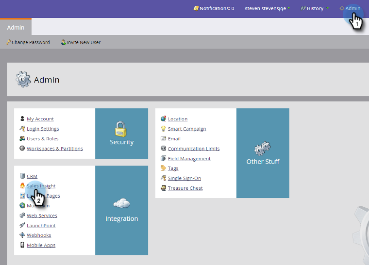

# Erteilen einer Lizenz für das Marketo-E-Mail-Add-in {#issue-a-marketo-email-add-in-license}

Jeder, der das Marketo E-Mail-[!DNL Outlook]-Add-in verwenden möchte, muss zunächst über eine Lizenz verfügen. Es gibt zwei Möglichkeiten, die Lizenz bereitzustellen.

* **[Enterprise Key Installation](/help/marketo/product-docs/marketo-sales-insight/msi-outlook-plugin/install-the-marketo-add-in-for-outlook-with-an-enterprise-key.md)**: Verwenden Sie diese Methode, wenn die Vertriebsmitarbeiter keine Administratorrechte für ihre Unternehmens-Notebooks haben und keine Plug-ins, Software usw. darauf installieren können. In diesem Fall erteilt der Marketo-Administrator Lizenzen an eine Liste autorisierter Benutzer. Als Nächstes stellt das IT-Team das Plug-in mithilfe des Enterprise Key remote auf den Computern aller autorisierten Benutzer bereit. Der Plug-in-Benutzer autorisiert es dann.
* **[Registrierungs-Code-Installation](/help/marketo/product-docs/marketo-sales-insight/msi-outlook-plugin/install-the-marketo-email-add-in-for-outlook-with-a-registration-code.md)**: Verwenden Sie diese Methode, wenn Vertriebsmitarbeiter Administratorrechte für ihren Unternehmens-Laptop haben und Plug-ins, Software usw. darauf installieren können. Für diesen Prozess stellt der Marketo-Administrator Lizenzen an eine Liste autorisierter Benutzer aus und sendet ihnen Registrierungs-E-Mails direkt mit Download-Links. Der Vertriebsmitarbeiter erhält eine E-Mail mit einem Plug-in-Download-Link und einer eindeutigen Registrierungs-URL.

>[!AVAILABILITY]
>
>Nicht alle Marketo Engage-Benutzer haben diese Funktion erworben. Weitere Informationen erhalten Sie beim Adobe Account Team (Ihrem Account Manager).

>[!NOTE]
>
>**Admin-Berechtigungen erforderlich**

1. Klicken Sie in My Marketo auf **[!UICONTROL Admin]** und dann auf **[!UICONTROL Sales Insight]**.

1. Klicken Sie auf der Registerkarte **[!UICONTROL E]** Mail-Add-In **[!UICONTROL auf „Lizenz]**.

   

1. Geben Sie die E-Mail-Adressen der Vertriebsmitarbeiter ein, die zur Verwendung des Plug-ins autorisiert werden müssen, und klicken Sie auf **[!UICONTROL Lizenz erteilen]**. Wenn Sie mehrere E-Mail-Adressen eingeben möchten, trennen Sie sie durch ein Komma.

   

   >[!NOTE]
   >
   >* Um das Plug-in remote zu installieren, lassen Sie das Kontrollkästchen _Registrierungs-E-Mail mit Download_ deaktiviert und senden Sie Ihrem IT-Team Ihren [Enterprise Key](/help/marketo/product-docs/marketo-sales-insight/msi-outlook-plugin/install-the-marketo-add-in-for-outlook-with-an-enterprise-key.md).
   >
   >* Wenn Ihre Vertriebsmitarbeiter Administratorzugriff auf ihre Computer haben, aktivieren Sie das Kontrollkästchen _Registrierungs-E-Mail mit Download_ und Sie sind fertig. Die Empfänger haben **30 Tage** um auf den Link in der E-Mail zu klicken, bevor diese abläuft.

>[!MORELIKETHIS]
>
>* [Installieren des Marketo-Add-Ins für  [!DNL Outlook]  mit einem Unternehmensschlüssel](/help/marketo/product-docs/marketo-sales-insight/msi-outlook-plugin/install-the-marketo-add-in-for-outlook-with-an-enterprise-key.md)
>* [Installieren des Marketo-E-Mail-Add-Ins für  [!DNL Outlook]  mit einem Registrierungs-Code](/help/marketo/product-docs/marketo-sales-insight/msi-outlook-plugin/install-the-marketo-email-add-in-for-outlook-with-a-registration-code.md)
>* [Aktualisieren des Marketo E-Mail-Add-ins für [!DNL Outlook]](/help/marketo/product-docs/marketo-sales-insight/msi-outlook-plugin/upgrade-your-marketo-email-add-in-for-outlook.md)
