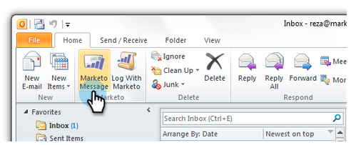

# Senden und Verfolgen aus Outlook mit einer Marketo-Vorlage {#send-and-track-from-outlook-using-a-marketo-template}

Wenn Ihr Marketing-Team Ihnen Vorlagen zur Verfügung gestellt hat, können Sie damit Zeit sparen, wenn Sie E-Mails erstellen.

>[!NOTE]
>
>Die Funktionen von Sales Insight-Aktionen, einschließlich &quot;E-Mail an Vertrieb senden&quot;, &quot;Zu Vertriebskampagne hinzufügen&quot;und &quot;Aufgaben&quot;, sind nicht in den Sales Insight-E-Mail-Plugins für Gmail und Outlook verfügbar. Derzeit können Benutzer von ihrem E-Mail-Client aus nur trackbare E-Mails mit oder ohne Marketo-E-Mail-Vorlage senden, wenn sie die Sales Insight-E-Mail-Plugins verwenden.

1. Öffnen Sie Microsoft Outlook und klicken Sie auf **Marketo Message**.

   

1. Wählen Sie die gewünschte Vorlage aus, zeigen Sie sie in der Vorschau an und klicken Sie auf **OK**.

   

1. Nehmen Sie alle Änderungen vor und klicken Sie dann auf **Senden und Verfolgen**.

   

   >[!NOTE]
   >
   >Token werden vom Add-in nicht unterstützt. Entfernen Sie alle Elemente, die sich möglicherweise in der Vorlage befinden.

1. Sehen Sie sich die Vorschau an, stellen Sie sicher, dass sie gut aussieht, und klicken Sie dann auf **Senden**.

   

   Und da geht&#39;s! Sie konnten mit Vorlagen, die Ihr supertolles Marketing-Team für Sie erstellt hat, viel Zeit sparen.

>[!MORELIKETHIS]
>
>[Eingehende E-Mails von Ihren Leads in Marketo anmelden](/help/marketo/product-docs/marketo-sales-insight/using-msi/log-inbound-mail-from-your-leads-in-marketo.md)
