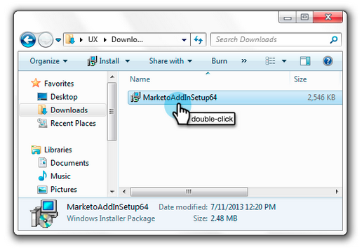
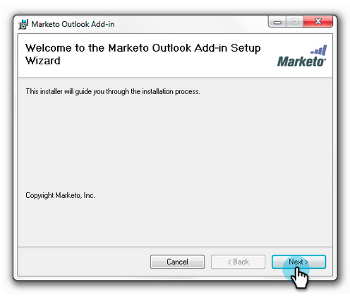
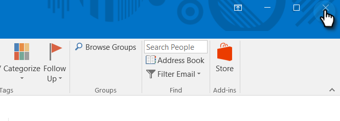
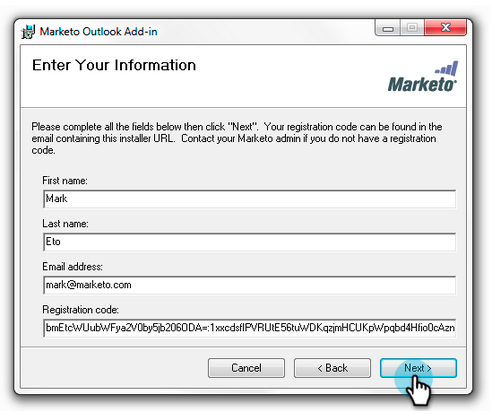
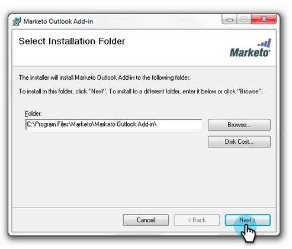
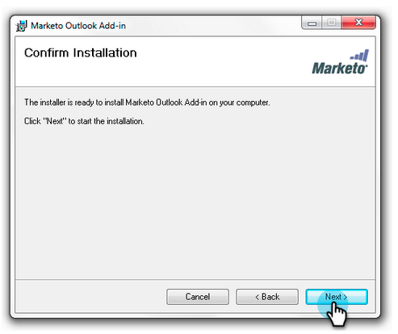
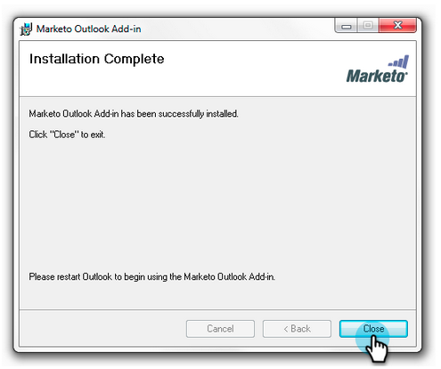
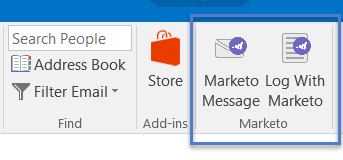

# Aktualisieren des Marketo-E-Mail-Add-ins für [!DNL Outlook] {#upgrade-your-marketo-email-add-in-for-outlook}

Wenn eine neue Version des Marketo-E-Mail-Add-ins für [!DNL Outlook] verfügbar ist, befolgen Sie diese Anweisungen zum Upgrade.

>[!NOTE]
>
>Ab dem 10/1/20 unterstützt die neueste Version des [!DNL Outlook]-Plug-ins den Offline-Modus nicht mehr. Dies wird nach der Installation/Aktualisierung am oder nach dem 10/1 wirksam.

## Installationsprogramm herunterladen {#download-installer}

Laden Sie das für Ihre Version von Microsoft [!DNL Outlook] geeignete Installationsprogramm herunter.

<table>
 <colgroup>
  <col>
  <col>
  <col>
  <col>
  <col>
 </colgroup>
 <tbody>
  <tr>
   <th> </th>
   <th colspan="2">Installation der Einladung für einen Benutzer</th>
   <th colspan="2">Installation des Unternehmensschlüssels</th>
  </tr>
  <tr>
   <td><strong>Outlook-Version</strong></td>
   <td><strong>32-bit</strong></td>
   <td><strong>64-bit</strong></td>
   <td><strong>32-bit</strong></td>
   <td><strong>64-bit</strong></td>
  </tr>
  <tr>
   <td>Outlook 2000</td>
   <td>Nicht unterstützt</td>
   <td>Nicht zutreffend</td>
   <td>Nicht unterstützt</td>
   <td>Nicht zutreffend</td>
  </tr>
  <tr>
   <td>Outlook 2003</td>
   <td><a href="https://munchkin.marketo.net/MarketoAddInSetup32.msi" rel="nofollow">Herunterladen</a></td>
   <td>Nicht zutreffend</td>
   <td>Nicht unterstützt</td>
   <td>Nicht zutreffend</td>
  </tr>
  <tr>
   <td>Ausblick 2007</td>
   <td><a href="https://munchkin.marketo.net/MarketoAddInSetup32.msi" rel="nofollow">Herunterladen</a></td>
   <td>Nicht zutreffend</td>
   <td>Nicht unterstützt</td>
   <td>Nicht zutreffend</td>
  </tr>
  <tr>
   <td>Ausblick 2010</td>
   <td><a href="https://munchkin.marketo.net/MarketoAddInSetup32.msi" rel="nofollow">Herunterladen</a></td>
   <td><a href="https://munchkin.marketo.net/MarketoAddInSetup64.msi" rel="nofollow">Herunterladen</a></td>
   <td><a href="https://munchkin.marketo.net/MarketoAddInSetup32.msi" rel="nofollow">Herunterladen</a></td>
   <td><a href="https://munchkin.marketo.net/MarketoAddInSetup64.msi" rel="nofollow">Herunterladen</a></td>
  </tr>
  <tr>
   <td>Ausblick 2013</td>
   <td><a href="https://munchkin.marketo.net/MarketoAddInSetup32.msi" rel="nofollow">Herunterladen</a></td>
   <td><a href="https://munchkin.marketo.net/MarketoAddInSetup64.msi" rel="nofollow">Herunterladen</a></td>
   <td><a href="https://munchkin.marketo.net/MarketoAddInSetup32.msi" rel="nofollow">Herunterladen</a></td>
   <td><a href="https://munchkin.marketo.net/MarketoAddInSetup64.msi" rel="nofollow">Herunterladen</a></td>
  </tr>
  <tr>
   <td>Ausblick 2016</td>
   <td><a href="https://munchkin.marketo.net/MarketoAddInSetup32.msi" rel="nofollow">Herunterladen</a></td>
   <td><a href="https://munchkin.marketo.net/MarketoAddInSetup64.msi" rel="nofollow">Herunterladen</a></td>
   <td><a href="https://munchkin.marketo.net/MarketoAddInSetup32.msi" rel="nofollow">Herunterladen</a></td>
   <td><a href="https://munchkin.marketo.net/MarketoAddInSetup64.msi" rel="nofollow">Herunterladen</a></td>
  </tr>
  <tr>
   <td colspan="1">Ausblick 2019</td>
   <td colspan="1"><a href="https://munchkin.marketo.net/MarketoAddInSetup32.msi" rel="nofollow">Herunterladen</a></td>
   <td colspan="1"><a href="https://munchkin.marketo.net/MarketoAddInSetup64.msi" rel="nofollow">Herunterladen</a></td>
   <td colspan="1"><a href="https://munchkin.marketo.net/MarketoAddInSetup32.msi" rel="nofollow">Herunterladen</a></td>
   <td colspan="1"><a href="https://munchkin.marketo.net/MarketoAddInSetup64.msi" rel="nofollow">Herunterladen</a></td>
  </tr>
  <tr>
   <td>Outlook für Mac</td>
   <td>Nicht unterstützt</td>
   <td>Nicht unterstützt</td>
   <td>Nicht unterstützt</td>
   <td>Nicht unterstützt</td>
  </tr>
  <tr>
   <td colspan="1">Outlook Web-App</td>
   <td colspan="1">Nicht unterstützt</td>
   <td colspan="1">Nicht unterstützt</td>
   <td colspan="1">Nicht unterstützt</td>
   <td colspan="1">Nicht unterstützt</td>
  </tr>
  <tr>
   <td colspan="1">Office 365*</td>
   <td colspan="1"><a href="https://munchkin.marketo.net/MarketoAddInSetup32.msi" rel="nofollow">Herunterladen</a></td>
   <td colspan="1"><a href="https://munchkin.marketo.net/MarketoAddInSetup64.msi" rel="nofollow">Herunterladen</a></td>
   <td colspan="1"><a href="https://munchkin.marketo.net/MarketoAddInSetup32.msi" rel="nofollow">Herunterladen</a></td>
   <td colspan="1"><a href="https://munchkin.marketo.net/MarketoAddInSetup64.msi" rel="nofollow">Herunterladen</a></td>
  </tr>
 </tbody>
</table>

&#42;Office 365-Version: Nur Windows-Client (unter Windows 10, Windows 11, Enterprise oder Pro).

## Upgrade {#upgrade}

1. Identifizieren Sie Ihre [[!DNL Microsoft Outlook] Version](https://support.microsoft.com/en-us/office/what-version-of-outlook-do-i-have-b3a9568c-edb5-42b9-9825-d48d82b2257c?ui=en-us&rs=en-us&ad=us).

1. Wählen Sie Ihre Version aus der obigen Liste aus.

1. Führen Sie das Installationsprogramm aus.

   

1. Klicken Sie auf **[!UICONTROL Weiter]**.

   

   >[!NOTE]
   >
   >In bestimmten Fällen fehlen die Daten. Kopieren Sie es aus der Registrierungs-E-Mail und schließen Sie dann [!DNL Outlook].

1. [!DNL Microsoft Outlook] schließen.

   

1. Sie werden feststellen, dass alle Ihre Informationen vorausgefüllt sind. Klicken Sie einfach **[!UICONTROL Weiter]**.

   

   >[!TIP]
   >
   >Wenn die Installation fehlschlägt, wenden Sie sich an Ihre IT-Abteilung, um sicherzustellen, dass der HTTPS-Traffic nicht blockiert wird. Für das Installationsprogramm muss HTTPS-Traffic geöffnet sein.

1. Klicken Sie **[!UICONTROL Weiter]**, um die Installation am Standardspeicherort durchzuführen.

   

1. Klicken Sie auf **[!UICONTROL Weiter]**.

   

1. Die Installation ist jetzt abgeschlossen. Klicken Sie auf **[!UICONTROL Schließen]**.

   

1. Öffnen Sie jetzt [!UICONTROL Microsoft Outlook], um die neueste Version der Marketo-Schaltflächen anzuzeigen.

   

>[!MORELIKETHIS]
>
>* [Senden und Verfolgen einer E-Mail mit dem Marketo E-Mail-Add-in für [!UICONTROL Outlook]](/help/marketo/product-docs/marketo-sales-insight/msi-outlook-plugin/send-and-track-an-email-with-the-email-add-in-for-outlook.md)
>* [Senden und Verfolgen aus [!UICONTROL Outlook] mithilfe einer Marketo-Vorlage](/help/marketo/product-docs/marketo-sales-insight/msi-outlook-plugin/send-and-track-from-outlook-using-a-marketo-template.md)
