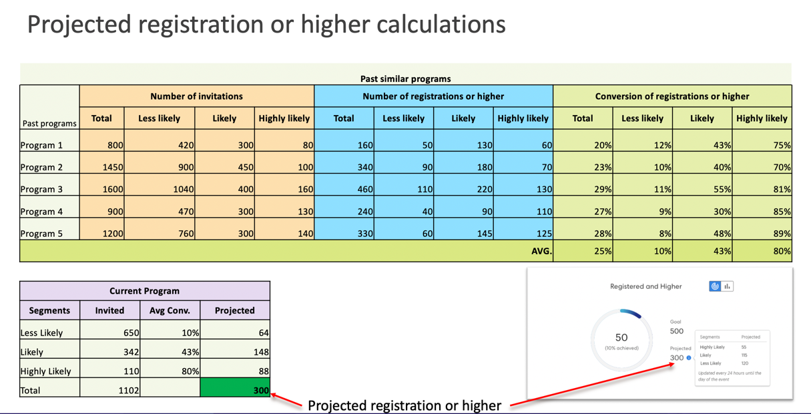

# Verstehen des Zieltrackings und der geplanten Registrierungen {#understanding-goal-tracking-and-projected-registrations}

Nachher [Festlegen von Ereigniszielen](/help/marketo/product-docs/marketo-sky/setting-event-goals.md) und Einladungen über eine [Smart-Kampagne](/help/marketo/product-docs/core-marketo-concepts/smart-campaigns/creating-a-smart-campaign/create-a-new-smart-campaign.md)Hier erfahren Sie, wie Sie Ihren Zielfortschritt verfolgen und die Prognosen von Marketo verstehen können.

>[!NOTE]
>
>Wenn ein Ereignisprogramm im Marketo Classic-Erlebnis erstellt wird, wird das Ereignisstartdatum derzeit standardmäßig auf das Erstellungsdatum des Ereignisses festgelegt. Da bei den projizierten Registrierungen die Zeit vor dem Startdatum eines Ereignisses berücksichtigt wird, sind diese Zahlen möglicherweise nicht korrekt, wenn Startdatum und Erstellungsdatum identisch sind (sofern sie nicht absichtlich festgelegt wurden).

## Zielverfolgung und geplante Registrierungen {#goal-tracking-and-projected-registrations}

1. Details zum Ziel-Tracking finden Sie im Abschnitt **[!UICONTROL Berichte]** Registerkarte Ihres Veranstaltungsprogramms. In diesem speziellen Beispiel gibt es bis jetzt 150 registrierte Mitglieder gegen ein Ziel von 200 (75%).

   

Sie werden auch Ihre **[!UICONTROL Projiziert]** Registrierungen. Bewegen Sie den Mauszeiger über das Informationssymbol, um eine Aufschlüsselung dieser Zahl nach Segment &quot;Wahrscheinlichkeit&quot;anzuzeigen.

>[!NOTE]
>
>Das Diagramm &quot;Geplant&quot;und &quot;Höher&quot;bleiben bis zum Tag des Ereignisses leer.

1. Klicken Sie auf die Schaltfläche Diagramm , um nach Registrierungswahrscheinlichkeit zu einer Aufschlüsselung Ihrer Mitglieder zu wechseln. Sie sehen die aktuellen Registrierungsprozentsätze für jedes Segment im Vergleich zum durchschnittlichen Prozentsatz für dieses Segment in Ihren vergangenen Programmen.

   

Alle (registrierten und noch nicht registrierten) Mitglieder werden nach ihrer Registrierungswahrscheinlichkeit kategorisiert. Bewegen Sie den Mauszeiger über das Infosymbol, um zu sehen, wie diese Wahrscheinlichkeitskategorien definiert sind.

>[!NOTE]
>
>Prognosen werden alle 24 Stunden bis zum Tag des Ereignisses aktualisiert. Alle Mitglieder, die als _Verarbeitung_ werden in den nächsten Berechnungszyklus einbezogen.

## Ähnliche Programme {#similar-programs}

Sie können Einblicke in Ihr aktuelles Ereignis erhalten, indem Sie sich ansehen, wie ähnliche Programme in der Vergangenheit funktioniert haben. Dieser Abschnitt zeigt Ihnen bis zu 5 ähnliche Programme aus den letzten 6 Monaten mit der Anzahl/dem Prozentsatz der Mitglieder, die _Angemeldet_ oder höher.

Bei der Berechnung ähnlicher Programme werden unter anderem folgende Faktoren berücksichtigt:

* Programmtyp
* Programmkanal
* Zielgruppengröße
* Programm-Tags
* Zeitdauer von der Ereigniserstellung bis zum Ereignisstart
* Ereignisdauer

   

## Empfehlungen {#recommendations}

Oben auf der Seite Berichte finden Sie KI/ML-basierte Empfehlungen, die auf Ihrem Fortschritt basieren. Besuchen Sie regelmäßig die Seiten, um nützliche Tipps und Einblicke zu erhalten!

## Vorhersagen auf Benutzerebene {#person-level-predictions}

Klicken Sie auf **[!UICONTROL Mitglieder]** um alle Programmmitglieder anzuzeigen. Bewegen Sie den Mauszeiger über die **[!UICONTROL Registrierungswahrscheinlichkeit]** oder **[!UICONTROL Wahrscheinlichkeit der Teilnahme]** Balken, um genaue Prozentsätze und Kategorisierungen anzuzeigen. Sie können dann Maßnahmen für Mitglieder einer bestimmten Kategorie ergreifen (z. B. für alle in der Kategorie &quot;Weniger wahrscheinlich&quot;, um sich zu registrieren) und sie gezielt ansprechen, um Ihre Registrierungsnummern potenziell zu erhöhen.

>[!NOTE]
>
>Die individuelle Wahrscheinlichkeit berücksichtigt mehr als 40 Personenfaktoren, einschließlich Profilattributen, Personenaktivitäten und Aktivitäten, die bereits eingeladen/registriert/besucht wurden.

## FAQs {#faq}

**F: Was ist das Segment?**

A: Die Wahrscheinlichkeit, sich zu registrieren, liegt bei 0 bis 100. Jede Person, die Mitglied des Veranstaltungsprogramms ist, erhält einen Wahrscheinlichkeitswert zwischen 0 und 100.

Wir unterteilen die Wahrscheinlichkeitswerte in drei Segmente:

* Wahrscheinlichkeit einer Registrierung > 50 % = Sehr wahrscheinliches Segment
* Wahrscheinlichkeit der Registrierung von mehr als 25 % bis &lt;50 % = wahrscheinliches Segment
* Wahrscheinlichkeit der Registrierung von &lt;25% = Segment mit geringerer Wahrscheinlichkeit

Wenn eine Person die Wahrscheinlichkeit erhält, sich zu registrieren, fällt die Prognose in eines dieser Segmente (jede Person, die Mitglied eines Programms ist, fällt in eines dieser Segmente). Wenn beispielsweise ein Ereignisprogramm aus 1000 Mitgliedern besteht, die auf den Wahrscheinlichkeitsvorhersagen basieren, werden diese 1000 verteilt in _Sehr wahrscheinlich_, _Wahrscheinlich_ oder _Weniger wahrscheinlich_ Segmente.

Daher haben Personen, die in das Segment &quot;Sehr wahrscheinlich&quot;fallen, eine höhere Chance, sich für die Veranstaltung zu registrieren.

Konversion in Registrierung = Anzahl der registrierten Personen im Segment dividiert durch die Anzahl der Personen, die in das Segment fallen (wenn beispielsweise 100 Personen in das Segment mit hoher Wahrscheinlichkeit fallen und 60 von ihnen registriert sind, beträgt die Konversionsrate 60 %).

Konversion % zur Registrierung folgt diesem Muster: Sehr wahrscheinlich > Wahrscheinlich > Weniger wahrscheinlich.

**F: Wie verwende ich die Einblicke?**

A: Best Practice umfasst Folgendes:

i. Erstellen Sie ein Programm, und dann verwendet eine Smart-Kampagne prädiktive Filter mit &quot;größer als X&quot;, was zu einer bestimmten Anzahl von Personen führen würde (z. B. 1000) und Sie führen die Kampagne aus.

ii. Nach 24 Stunden in der [!UICONTROL Berichte] -Tab können Sie die voraussichtlichen Registrierungen sehen, die auf der Grundlage der Wahrscheinlichkeit berechnet werden, dass die Werte aller aktuell eingeladenen Personen registriert werden.

iii. Wenn die geplanten Registrierungen geringer sind als das Ziel, müssten Sie mehr Personen einladen. An diesem Punkt können Sie die Einblicke sehen, die Ihnen mitteilen, welche Schwelle in früheren Programmen funktioniert hat.

iv. Sie können eine neue Smart-Kampagne mit diesem Schwellenwert erstellen, um weitere Personen einzuladen.

v. Sie können jederzeit die Zielgruppen-Verteilung über Segmente und deren Konversionsraten aus der Vergangenheit hinweg anzeigen und diese Konversionsraten auf die aktuelle Zielgruppe anwenden, um zu verstehen, warum eine projizierte Zahl angezeigt wird (siehe Screenshot unten).

**F: Was ist das Diagramm Segmente nach Registrierung?**

A: Drei Balken, von denen jeder ein Segment darstellt (hoch wahrscheinlich, wahrscheinlich, weniger wahrscheinlich).

**violette gepunktete Linie:** Durchschnittliche Konversationsrate zur Registrierung in diesem Segment, basierend auf früheren ähnlichen Programmen.

**Blaue Leiste:** Registrierungsprozentsatz aller Personen in diesem Segment.

Nehmen wir beispielsweise an, 100 Personen haben eine Wahrscheinlichkeit, sich bei > 50 % und 60 von 100 registrierten Personen zu registrieren. Eine Konversion von 60 % ist höchstwahrscheinlich. So erhalten alle zum Programm hinzugefügten Mitglieder die Wahrscheinlichkeit, Werte zu registrieren, dann werden sie in Segmente eingefügt und entsprechend der Anzahl der in den einzelnen Segmentkonversionsraten registrierten Personen berechnet.

**F: Was bedeutet &quot;Registered and Higher&quot;?**

A: Jede Person, die als registriert aufgeführt ist, oder jeder andere Status mit einer gleichwertigen oder höheren Schrittnummer.

Sie können neue Progressionsstatus für ein Ereignisprogramm erstellen, aber wir ordnen diese Status den Standardstatus zu. Betrachten wir einen Fall, in dem eine Person von einer eingeladenen in eine Erinnerung verschoben wird, was einen höheren Schritt als die Registrierung darstellt. Diese Person gilt auch als registriert und wird im Ziel-Tracking angezeigt.

**F: Wie werden die voraussichtlichen Registrierungen berechnet?**

A: Siehe unten.

