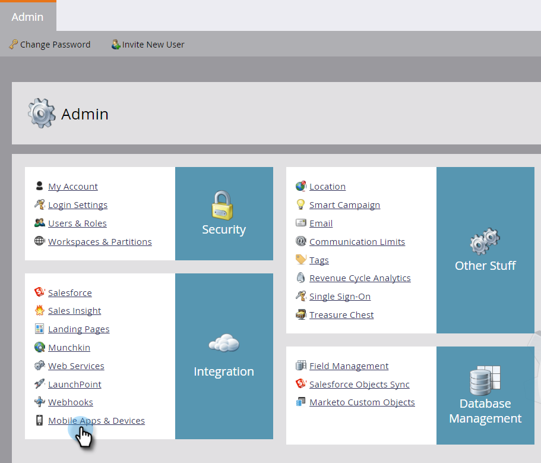

# Hinzufügen einer Mobile App {#add-a-mobile-app}

Senden Sie Push-Benachrichtigungen an Ihren Kundenstamm, indem Sie Ihre Mobile App mit Marketo verbinden.

Apps beginnen normalerweise in einer Sandbox-Umgebung, in der die anfängliche Entwicklung und Tests durchgeführt werden. Entwickler verwenden dann eine Produktionsumgebung, um die endgültige App zu erstellen, die von Kunden verwendet wird. Sie müssen beim Hinzufügen einer Mobile App das entsprechende Benachrichtigungszertifikat auswählen (siehe Schritt 4 unten).

>[!AVAILABILITY]
>
>
>Nicht alle Marketo Engage-Benutzer haben diese Funktion erworben. Weitere Informationen erhalten Sie beim Adobe Account Team (Ihrem Account Manager).

1. Klicken Sie auf **Admin**.

   

1. Klicken Sie **Mobile Apps &amp; Devices**.

   

1. Klicken Sie auf **Neue App**.

   

1. Geben Sie einen Namen ein. Wählen **in der**-Liste „Typ“ den verwendeten Umgebungstyp aus: Sandbox oder Produktion. Klicken Sie auf **Speichern**.

   

   >[!NOTE]
   >
   >Es wird empfohlen, ein Produktionsbenachrichtigungszertifikat in einer Produktionsumgebung zu verwenden. Ein Sandbox-Zertifikat wird problemlos in einer Produktionsumgebung installiert. Sie erhalten jedoch keine Benachrichtigungen. Wenden Sie sich bei Fragen zu Ihrer Umgebung oder Ihrem Benachrichtigungszertifikat an Ihren Marketo-Administrator oder den Entwickler Ihrer mobilen Apps.

   Schön! Konfigurieren wir nun Ihre App für die Verwendung mit Android- und iOS-Geräten.

>[!MORELIKETHIS]
>
>* [Mobile App Android Push-Zugriff konfigurieren](/help/marketo/product-docs/mobile-marketing/admin/configure-mobile-app-android-push-access.md)
>* [Mobile App iOS Push-Zugriff konfigurieren](/help/marketo/product-docs/mobile-marketing/admin/configure-mobile-app-ios-push-access.md)
