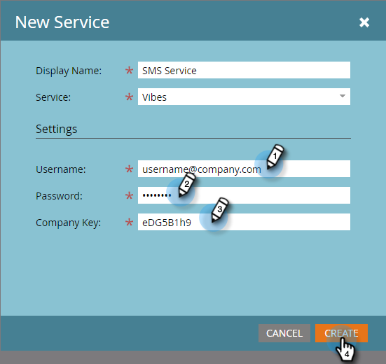

# hinzufügen Vibes as a LaunchPoint Service {#add-vibes-as-a-launchpoint-service}

Sie können SMS-Nachrichten an die Personen in Ihren Vibes-Listen senden und mit der SMS-Aktivität Kampagnen auslösen und filtern. Zunächst müssen Sie Vibes als LaunchPoint-Dienst hinzufügen.

>[!NOTE]
>
>**Administratorberechtigungen erforderlich**

>[!NOTE]
>
>Sie benötigen sowohl die Marketo-Administratorberechtigungen als auch ein aktives Vibes-Konto, um diese Einrichtung abzuschließen. Die in Schritt 4 angeforderten Anmeldeinformationen entsprechen den Anmeldeinformationen Ihres Vibes-Kontos.

1. Klicken Sie in &quot;My Marketo&quot;auf **Admin** und dann **LaunchPoint**.

   

1. Klicken Sie auf **Neu** und **Neuer Dienst**.

   

1. Geben Sie einen Anzeigenamen ein und wählen Sie in der Dropdown-Liste **Vibes**.

   

1. Geben Sie unter &quot;Einstellungen&quot;Ihren Benutzernamen, Ihr Kennwort und Ihren API-Firmen-Schlüssel ein. Klicken Sie auf **Erstellen**.

   

   Der neue SMS-Dienst wird jetzt in der Liste &quot;Installierte Dienste&quot;angezeigt.

   

