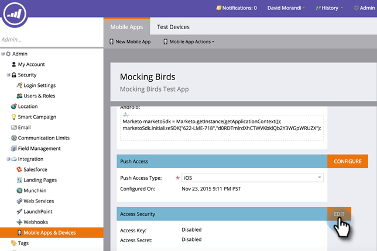

# Authentifizieren der Sicherheit des mobilen Zugriffs {#authenticate-mobile-access-security}

Um die Sicherheit für Mobilbenutzer zu verbessern, stellt Marketo zwei neue IDs bereit: den Zugriffsschlüssel und den Zugriffsgeheimnis. Diese stellen sicher, dass Benutzer, die sich bei Ihrer App anmelden, tatsächlich die sind, die sie zu sein scheinen.

Um die IDs zu aktivieren, müssen Sie die Codes abrufen und sie Ihrer IT-Abteilung bereitstellen, damit sie eine sichere Übereinstimmung einrichten können.

>[!PREREQUISITES]
>
>Wenden Sie sich zur Aktivierung dieser Funktion an den Support und fordern Sie &quot;Vespa Secure Mode&quot;an.

1. Wählen Sie in Marketo **Admin** und klicken Sie auf **Mobile Apps and Devices**.

   

1. Wählen Sie die Mobile App aus, für die Sie sicheren Zugriff aktivieren möchten.

   

1. Scrollen Sie nach unten und klicken Sie im Abschnitt Zugriffssicherheit auf **Bearbeiten**.

   

1. Aktivieren Sie das Kontrollkästchen **Sicherheit aktivieren** . Klicken Sie auf **Speichern**.

   

1. Im Bereich Zugriffssicherheit werden nun die beiden neuen Codes angezeigt. Senden Sie diese an Ihre IT-Abteilung.

   
