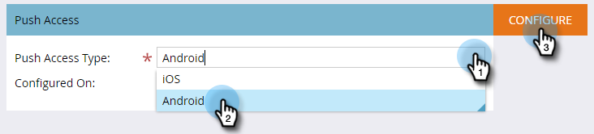

# Mobile App-Android-Push-Zugriff konfigurieren {#configure-mobile-app-android-push-access}

1. Klicken Sie auf **Admin**.

   

1. Wählen Sie &quot; **Mobile Apps**&quot;aus.

   

   Wählen Sie die gewünschte mobile App aus.

   

1. Wählen Sie unter &quot; **Push-Zugriffstyp**&quot;die Option **Android** und klicken Sie auf **Konfigurieren.**

   

   >[!NOTE]
   >
   >Sie benötigen einen **Server-API-Schlüssel** und eine **Projektnummer** von Ihrem Entwickler für mobile Apps. Der Entwickler erhält diese Informationen, indem er sich bei der Google Play Developer Console anmeldet, um Ihre App zu registrieren und Cloud Messaging zu aktivieren.

   Geben Sie Ihren Server-API-Schlüssel und Ihre Projektnummer ein. Klicken Sie auf Speichern.

   

   Süß. Stellen Sie sicher, dass Sie die App mit iOS konfigurieren.

>[!MORELIKETHIS]
>
>* [Mobile App konfigurieren - Push-Zugriff auf iOS](configure-mobile-app-ios-push-access.md)

>

