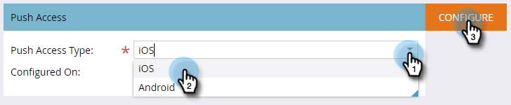

# Mobile App iOS Push-Zugriff konfigurieren {#configure-mobile-app-ios-push-access}

1. Klicken Sie auf **Admin**.

   

1. Wählen Sie **Mobile Apps** aus.

   

1. Wählen Sie die gewünschte Mobile App aus.

   

1. Wählen Sie unter Push-Zugriffstyp die Option iOS aus und klicken Sie auf **Konfigurieren**.

   

   >[!NOTE]
   >
   >Sie benötigen ein **Zertifikat** und **Kennwort** von Ihrem Entwickler für Mobile Apps. Der Entwickler erhält diese Informationen, indem er sich beim Apple Developer Member Center anmeldet, ein Push-Benachrichtigungszertifikat für Ihre App einrichtet und herunterlädt und den Inhalt exportiert. Der Entwickler legt das Kennwort beim Exportieren fest. **WICHTIG**: Das Zertifikat sollte für die Art der Umgebung, die Sie verwenden, geeignet sein - Sandbox oder Produktion. Überprüfen Sie dies mit Ihrem Marketo Admin oder Entwickler von Mobile Apps.

1. Wählen Sie Ihr Zertifikat aus, geben Sie Ihr Kennwort ein und klicken Sie auf **Speichern**.

   

Gute Arbeit! Stellen Sie sicher, dass Sie die App auch mit Android konfigurieren.

>[!MORELIKETHIS]
>
>[Mobile App Android Push-Zugriff konfigurieren](/help/marketo/product-docs/mobile-marketing/admin/configure-mobile-app-android-push-access.md)
