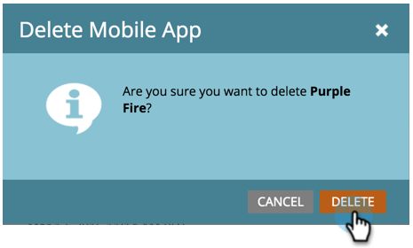

# Löschen von Mobile App {#delete-mobile-app}

1. Klicken Sie auf **[!UICONTROL Admin]**.

   

1. Wählen Sie **[!UICONTROL Mobile Apps]** aus.

   

1. Wählen Sie die gewünschte Mobile App aus.

   

1. Klicken Sie auf **[!UICONTROL Aktionen für Mobile Apps]** und wählen Sie **[!UICONTROL App löschen]** aus.

   

1. Bestätigen Sie mit **[!UICONTROL Löschen]**.

   

Ta-da! Push-Benachrichtigungen können nicht mehr über diese Mobile App gesendet werden.
