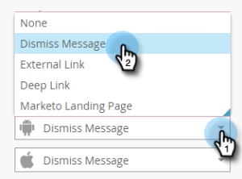

# hinzufügen In-App-Nachrichtenbilder {#add-in-app-message-images}

Hier wählen Sie die Bilder für In-App-Nachrichten aus und passen sie an.

1. Wählen Sie die In-App-Nachricht aus und klicken Sie auf **Entwurf bearbeiten**.

   

1. Wählen Sie auf der Registerkarte &quot;Layout&quot;eine der sechs Vorlagen aus. Es gibt drei Optionen für Popup und drei für Vollbildmodus.

   >[!TIP]
   >
   >Was ist der Unterschied zwischen den Vorlagen? Siehe [Wählen Sie ein Layout für Ihre In-App-Nachricht](/help/marketo/product-docs/mobile-marketing/in-app-messages/creating-in-app-messages/choose-a-layout-for-your-in-app-message.md), bevor Sie beginnen.

   

1. Klicken Sie auf die Registerkarte **Stil** und dann auf den Bildbereich der Vorlage.

   

1. Klicken Sie auf **Bild** auswählen.

   

1. Wählen Sie Ihr Bild aus dem Design Studio und klicken Sie auf **Wählen Sie**.

   

   >[!NOTE]
   >
   >Die Bildgröße ist auf 1440 x 2560 Pixel und 5 MB begrenzt.

1. Verändere deine Meinung und möchte ein anderes Bild verwenden? Kein Problem. Klicken Sie auf **X** neben dem Bilddateinamen.

   

1. Klicken Sie auf **Entfernen**. Jetzt können Sie einen anderen auswählen.

   

1. Wenn das gewünschte Bild an der gewünschten Stelle platziert ist, wählen Sie in den Bildeigenschaften eine Schaltfläche aus, um das Bild nach Höhe, Breite oder Beides anzupassen.

   

1. Wenden Sie optional einen Bildrand an. Die Standardeinstellung ist **Aus**. Wählen Sie zunächst Farbe aus, indem Sie darauf klicken oder die Hex- oder RGB-Nummern in der Farbauswahl eingeben.

   

1. Klicken Sie auf die Pfeile, um die Rahmenbreite in Pixel zu ändern. Sie werden sehen, wie es sich auf dem Bild ändert.

   

1. Wählen Sie mit dem Schieberegler einen Eckenradius aus. Wählen Sie eine Position von links nach rechts aus: 0, 4, 8, 12 oder 16 Pixel. Die 8-Pixel-Auswahl ist die Standardeinstellung.

   

1. Wählen Sie einen Rand aus (ein oder aus). **Dies ist** die Standardeinstellung.

   

1. Markieren Sie das Kästchen, um eine Bildtippaktion zu definieren.

   

1. Für jede Plattform gibt es eine separate Aktion (siehe Hinweis).

   

1. Klicken Sie auf jede Dropdown-Liste, um die Optionen anzuzeigen. Wählen Sie eine aus.

   

   >[!NOTE]
   >
   >Für Tippen-Aktionen für Bilder, Schaltflächen oder Hintergründe können Sie verschiedene Aktionen für Apple- und Android-Plattformen einrichten. Deep-Links werden beispielsweise für Apple und Android unterschiedlich behandelt. Wenn Ihre Nachricht nur zu einer Plattform oder zur anderen führt, lassen Sie die andere in der Standardeinstellung oder wählen Sie **Keine**.

Gute Arbeit! Jetzt ist es an der Zeit, [den Text für Ihre In-App-Nachricht](/help/marketo/product-docs/mobile-marketing/in-app-messages/creating-in-app-messages/create-in-app-message-text.md) zu erstellen.

>[!MORELIKETHIS]
>
>* [Informationen zu In-App-Nachrichten](/help/marketo/product-docs/mobile-marketing/in-app-messages/understanding-in-app-messages.md)
>* [Layout für Ihre In-App-Nachricht auswählen](/help/marketo/product-docs/mobile-marketing/in-app-messages/creating-in-app-messages/choose-a-layout-for-your-in-app-message.md)

