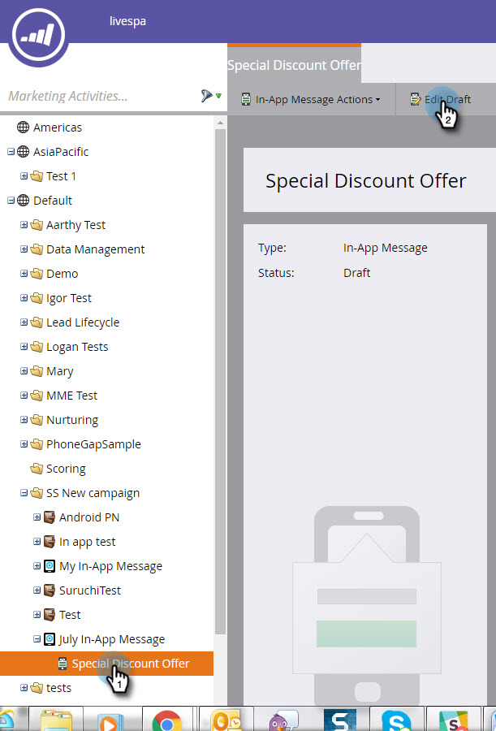
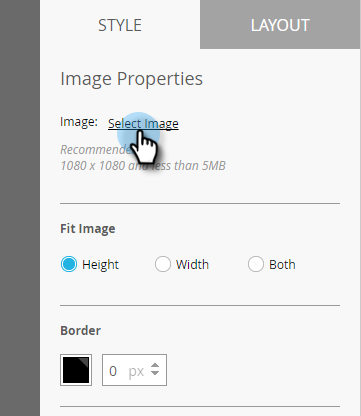
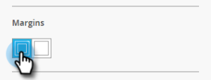

# In-App-Nachrichtenbilder hinzufügen {#add-in-app-message-images}

Hier wählen und passen Sie die Bilder Ihrer In-App-Nachrichten an.

1. Wählen Sie die In-App-Nachricht aus und klicken Sie auf **Entwurf bearbeiten**.

   

1. Wählen Sie auf der Registerkarte Layout eine der sechs Vorlagen aus. Es gibt drei Optionen für Popup und drei Vollbildmodi.

   >[!TIP]
   >
   >Was ist der Unterschied zwischen den Vorlagen? Siehe [Layout für Ihre In-App-Nachricht auswählen](/help/marketo/product-docs/mobile-marketing/in-app-messages/creating-in-app-messages/choose-a-layout-for-your-in-app-message.md) , bevor Sie beginnen.

   

1. Klicken Sie auf die Registerkarte **Stil** und dann auf den Bildbereich der Vorlage.

   

1. Klicken Sie auf **Bild auswählen**.

   

1. Wählen Sie Ihr Bild aus dem Design Studio aus und klicken Sie auf **Auswählen**.

   

   >[!NOTE]
   >
   >Die Bildgröße ist auf 1440 x 2560 Pixel und 5 MB begrenzt.

1. Verändern Sie Ihre Meinung und möchten ein anderes Bild verwenden? Kein Problem. Klicken Sie auf den **X** neben dem Namen der Bilddatei.

   

1. Klicken Sie auf **Entfernen**. Jetzt kannst du noch eins wählen.

   

1. Wählen Sie bei platziertem Bild in den Bildeigenschaften eine Schaltfläche aus, um das Bild nach Höhe, Breite oder Beidem anzupassen.

   

1. Wenden Sie optional einen Bildrahmen an. Die Standardeinstellung ist **Aus**. Wählen Sie zuerst Farbe aus, indem Sie darauf klicken oder die Hex- oder RGB-Nummer in die Farbauswahl eingeben.

   

1. Klicken Sie auf die Pfeile, um die Rahmenbreite in Pixel zu ändern. Sie werden sehen, dass sich das Bild ändert.

   

1. Wählen Sie mit dem Schieberegler einen Eckenradius aus. Wählen Sie eine Position von links nach rechts aus: 0, 4, 8, 12 oder 16 Pixel. Die 8-Pixel-Auswahl (Mitte) ist die Standardeinstellung.

   

1. Wählen Sie einen Rand aus (ein- oder aus). **On** ist die Standardeinstellung.

   

1. Aktivieren Sie das Kontrollkästchen, um eine Aktion für Bild-Tippen zu definieren.

   

1. Für jede Plattform gibt es eine separate Aktion (siehe Hinweis).

   

1. Klicken Sie auf jedes Dropdown-Menü, um die Optionen anzuzeigen. Wählen Sie eins aus.

   

   >[!NOTE]
   >
   >Für Tippen-Aktionen für Bilder, Schaltflächen oder Hintergründe können Sie verschiedene Aktionen für Apple- und Android-Plattformen einrichten. Deep-Links werden beispielsweise für Apple und Android unterschiedlich gehandhabt. Wenn Ihre Nachricht nur auf die eine oder die andere Plattform gesendet wird, lassen Sie die andere Plattform in der Standardeinstellung oder wählen Sie **Keine** aus.

Tolle Arbeit! Jetzt ist es an der Zeit, [den Text für Ihre In-App-Nachricht zu erstellen](/help/marketo/product-docs/mobile-marketing/in-app-messages/creating-in-app-messages/create-in-app-message-text.md).

>[!MORELIKETHIS]
>
>* [Grundlegendes zu In-App-Nachrichten](/help/marketo/product-docs/mobile-marketing/in-app-messages/understanding-in-app-messages.md)
>* [Layout für Ihre In-App-Nachricht auswählen](/help/marketo/product-docs/mobile-marketing/in-app-messages/creating-in-app-messages/choose-a-layout-for-your-in-app-message.md)
