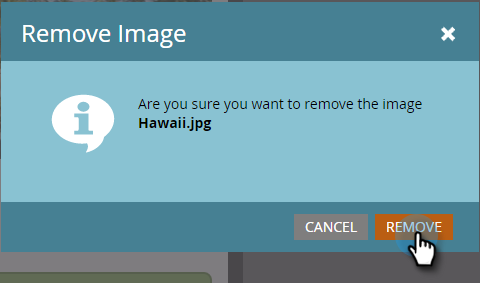

# Hinzufügen von In-App-Nachrichtenbildern {#add-in-app-message-images}

Hier können Sie Ihre In-App-Nachrichtenbilder auswählen und anpassen.

1. Wählen Sie die In-App-Nachricht aus und klicken Sie auf **[!UICONTROL Entwurf bearbeiten]**.

   

1. Wählen Sie auf der Registerkarte Layout eine der sechs Vorlagen aus. Es gibt drei Popup- und drei Vollbildoptionen.

   >[!TIP]
   >
   >Was ist der Unterschied zwischen den Vorlagen? Siehe [Auswählen eines Layouts für Ihre In-App-Nachricht](/help/marketo/product-docs/mobile-marketing/in-app-messages/creating-in-app-messages/choose-a-layout-for-your-in-app-message.md) bevor Sie beginnen.

   

1. Klicken Sie auf **[!UICONTROL Registerkarte]** Stil“ und dann auf den Bildbereich der Vorlage.

   

1. Klicken Sie **[!UICONTROL Bild auswählen]**.

   

1. Wählen Sie Ihr Bild im Design Studio aus und klicken Sie auf **[!UICONTROL Auswählen]**.

   

   >[!NOTE]
   >
   >Die Bildgröße ist auf 1440 x 2560 Pixel und 5 MB beschränkt.

1. Sie möchten ein anderes Bild verwenden? Kein Problem. Klicken Sie auf **X** neben dem Dateinamen des Bildes.

   

1. Klicken Sie auf **[!UICONTROL Entfernen]**. Jetzt können Sie sich einen anderen aussuchen.

   

1. Wählen Sie bei eingefügtem Bild in [!UICONTROL Bildeigenschaften] eine Schaltfläche aus, um das Bild nach Höhe, Breite oder beidem anzupassen.

   

1. Wenden Sie optional einen Bildrahmen an. Die Standardeinstellung ist **Aus**. Wählen Sie zunächst eine Farbe aus, indem Sie darauf klicken oder die Hex- oder RGB-Zahlen in der Farbauswahl eingeben.

   

1. Klicken Sie auf die Pfeile, um die Rahmenbreite in Pixel zu ändern. Sie werden sehen, wie es sich auf dem Bild ändert.

   

1. Wählen Sie mit dem Schieberegler einen Eckenradius aus. Position von links nach rechts auswählen: 0, 4, 8, 12 oder 16 Pixel. Die 8-Pixel-Auswahl (Mitte) ist die Standardauswahl.

   

1. Wählen Sie einen Rand aus (ein oder aus). **Ein** ist die Standardeinstellung.

   

1. Aktivieren Sie das Kontrollkästchen, um eine Bildtipp-Aktion zu definieren.

   

1. Für jede Plattform gibt es eine eigene Aktion (siehe Hinweis).

   

1. Klicken Sie auf die einzelnen Dropdown-Listen, um die Optionen anzuzeigen. Wählen Sie eine aus.

   

   >[!NOTE]
   >
   >Für Tipp-Aktionen für Bilder, Schaltflächen oder Hintergründe können Sie verschiedene Aktionen für Apple- und Android-Plattformen einrichten. Deep-Links werden beispielsweise für Apple und Android unterschiedlich gehandhabt. Wenn Ihre Nachricht nur zu einer bestimmten Plattform gesendet wird, lassen Sie die andere in der Standardeinstellung oder wählen Sie **[!UICONTROL Keine]** aus.

Tolle Arbeit! Jetzt ist es an der Zeit, [den Text für Ihre In-App-Nachricht zu erstellen](/help/marketo/product-docs/mobile-marketing/in-app-messages/creating-in-app-messages/create-in-app-message-text.md).

>[!MORELIKETHIS]
>
>* [Verstehen von In-App-Nachrichten](/help/marketo/product-docs/mobile-marketing/in-app-messages/understanding-in-app-messages.md)
>* [Wählen Sie ein Layout für Ihre In-App-Nachricht aus](/help/marketo/product-docs/mobile-marketing/in-app-messages/creating-in-app-messages/choose-a-layout-for-your-in-app-message.md)
