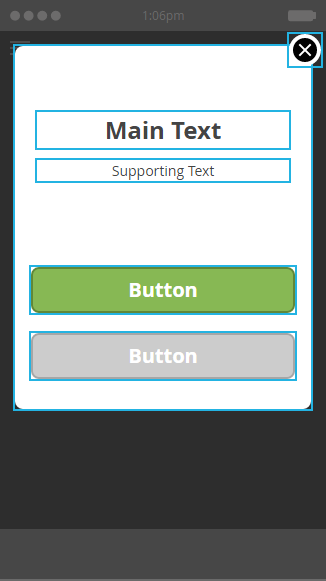

# Auswählen eines Layouts für Ihre In-App-Nachricht {#choose-a-layout-for-your-in-app-message}

Marketo bietet sechs Layouts zum Erstellen von In-App-Nachrichten.

* Pop-Up-Layouts sind traditioneller und ideal, wenn Sie kein Kreativteam haben, um Inhalte bereitzustellen, und Sie kein bestimmtes Erscheinungsbild benötigen. In Marketo können Sie ganz einfach Ihre eigene In-App-Nachricht erstellen und bearbeiten
* Mit Vollbild-Layouts können Sie Ihre eigenen fertigen Designs importieren und erhalten so eine vollständige Grafikflexibilität.

## Popupfenster für Layouts {#pop-up-layouts}

Die drei Pop-Up-Layouts bieten alle vordefinierten Design-Elemente, einschließlich Bild, Text, Schaltflächen und Hintergrund.

Das erste Popup-Layout ist aus gutem Grund die Standardauswahl: Es passt zu den meisten Verwendungen. Es funktioniert problemlos mit Bildern mit niedrigerer Auflösung. Bei diesem Layout werden die Standardschriftarten für Ihre Plattform verwendet (Helvetica für Apple, Roboto für Android), sodass es immer auf einem Smartphone oder Tablet richtig aussieht. Sie können die Haupt- und Hintergrundbilder hochladen und platzieren, Ihren eigenen Haupt- und unterstützenden Text schreiben und die Haupt- und Schließen-Schaltflächen konfigurieren. Text ist auf drei Zeilen bei 24 Pixel begrenzt. Größere Schriftgrößen reduzieren die Anzahl der Zeilen.

Mit dem zweiten Popup-Layout werden die Textfelder entfernt, sodass Sie mehr Platz für ein größeres Bild haben. Fügen Sie dem Bild vor dem Import Text in Ihrem gewünschten Stil hinzu, um es benutzerdefiniert anzusehen.

Das dritte Popup-Layout eignet sich hervorragend, wenn Sie kein Bild in Ihrer In-App-Nachricht verwenden müssen. Zwei Schaltflächen bieten Empfängern von Nachrichten eine Auswahl an Aktionen. Text ist auf drei Zeilen beschränkt. Größere Schriftgrößen verringern die Anzahl der verfügbaren Zeilen.

## Vollbildlayouts {#full-screen-layouts}

Die drei Layouts im Vollbildstil wurden für den Import fertiger Grafiken entwickelt. Wählen Sie Ihre eigenen Schriftarten aus und betten Sie sie in die Grafik ein, um sie mit einer beliebigen Webseite oder Promotion abzugleichen.

Das erste Vollbild-Layout bietet eine leere Arbeitsfläche. Es zeigt genau, was Sie hochladen, ohne das Bild zu dehnen oder zu beschneiden (siehe Beispiel unten). Je nach Bildform wird die Bildgröße verkleinert, wobei leere Bereiche daneben bleiben. Kein Teil des Bildes wird entfernt.

Beachten Sie, dass dieses horizontale Bild seine volle Breite anzeigt, ohne dass ein Leerraum über und unter bleibt.

Das zweite Vollbild-Layout fügt Textfelder und eine Schaltfläche hinzu.

Im Gegensatz zum ersten Vollbild-Layout erweitert dieses zusammen mit dem dritten Vollbild-Layout (unten) das platzierte Bild, sodass es in die volle Höhe passt, und schneidet die Seiten ab. Je nach Originalbild kann dies zu einem überzeugenden Hintergrundbild führen. Dieses Beispiel verwendet dasselbe Bild wie das oben dargestellte.

Das dritte Vollbild-Layout entspricht dem zweiten, mit Ausnahme der zweiten Schaltfläche. Dadurch erhalten Nachrichtenempfänger mehr Optionen.

Nachdem Sie jetzt über die Vorlagen informiert sind, können Sie eine Vorlage auswählen, wenn Sie [Bilder für In-App-Nachrichten erstellen](/help/marketo/product-docs/mobile-marketing/in-app-messages/creating-in-app-messages/add-in-app-message-images.md).

>[!MORELIKETHIS]
>
>[Grundlegendes zu In-App-Nachrichten](/help/marketo/product-docs/mobile-marketing/in-app-messages/understanding-in-app-messages.md)
