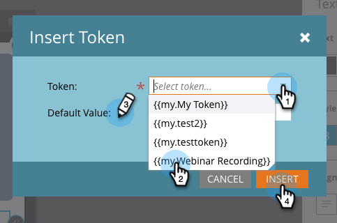

# Erstellen von In-App-Nachrichtentext {#create-in-app-message-text}

Klicken Sie auf den Textbereich, um Ihren Textstil und -inhalt zu bearbeiten.

>[!CAUTION]
>
>Es wird empfohlen, keine Emojis in Ihrem Text zu verwenden, da sie derzeit nicht vollständig unterstützt werden.

1. Klicken Sie auf den Haupttext, um ihn inline zu bearbeiten.

   

1. Wählen Sie die Textfarbe aus, indem Sie darauf klicken oder die Hex- oder RGB-Zahlen in der Farbauswahl eingeben.

   

1. Klicken Sie auf die Pfeile, um eine Textgröße auszuwählen.

   

   >[!CAUTION]
   >
   >Bei einer zu großen Textgröße wird der Inhalt möglicherweise über die maximal drei sichtbaren Textzeilen hinausgeschoben.

1. Wählen Sie einen optionalen Typstil für die Hervorhebung aus **„Fett**, _Kursiv_ oder Unterstreichen.

   

1. Textausrichtung auswählen: Links, zentriert, rechts. Zentriert ist der Standardwert.

   

   >[!NOTE]
   >
   >Die in der Anzeige gerenderte Textschriftart ist die Standardschriftart für jede Plattform: Helvetica für Apple und Roboto für Android

1. Markieren Sie das Kästchen, um Text (**[!UICONTROL )]**.

   

1. Wählen Sie für jede Plattform eine Tipp-Aktion aus: Apple oder Android.

   

   >[!NOTE]
   >
   >Für Tipp-Aktionen können Sie verschiedene Aktionen für Apple- und Android-Plattformen einrichten. Deep-Links werden beispielsweise für Apple und Android unterschiedlich gehandhabt. Wenn Ihre Nachricht nur zu einer bestimmten Plattform gesendet wird, können Sie die andere in der Standardeinstellung belassen oder auf [!UICONTROL Keine] klicken.

1. Klicken Sie auf den unterstützenden Text, um ihn inline zu bearbeiten. Dies funktioniert genauso wie die Bearbeitung des Haupttexts, aber die standardmäßige Textgröße ist kleiner.

   

1. Klicken Sie für den Haupt- oder den unterstützenden Text auf das Token-Symbol, um ein Token hinzuzufügen.

   

1. Wählen Sie ein Mein Token aus der Dropdown-Liste aus, fügen Sie einen Standardwert hinzu und klicken Sie auf **[!UICONTROL Einfügen]**.

   

   >[!NOTE]
   >
   >Nur „Meine Token“ sind als Optionen verfügbar. Wenn keine „Meine Token“ im Programm eingerichtet wurden, ist die [!UICONTROL Token]-Dropdown-Liste leer.

   >[!TIP]
   >
   >Denken Sie daran, wie lange ein Token aufgelöst werden soll, wenn es von Ihrer Zielgruppe angezeigt wird. Lassen Sie genügend Platz, um potenziell längere Werte zu berücksichtigen, damit sie nicht abgeschnitten werden.

   Änderungen an Token, die in einem genehmigten In-App-Nachrichtenprogramm verwendet werden, werden in der In-App-Nachricht erst wirksam, wenn das Programm angehalten und dann fortgesetzt wird.

Du bist golden. Als Nächstes müssen Sie [die In-App-Nachrichtenschaltfläche einrichten](/help/marketo/product-docs/mobile-marketing/in-app-messages/creating-in-app-messages/set-up-the-in-app-message-button.md).

>[!MORELIKETHIS]
>
>* [Verstehen von In-App-Nachrichten](/help/marketo/product-docs/mobile-marketing/in-app-messages/understanding-in-app-messages.md)
>* [Wählen Sie ein Layout für Ihre In-App-Nachricht aus](/help/marketo/product-docs/mobile-marketing/in-app-messages/creating-in-app-messages/choose-a-layout-for-your-in-app-message.md)
