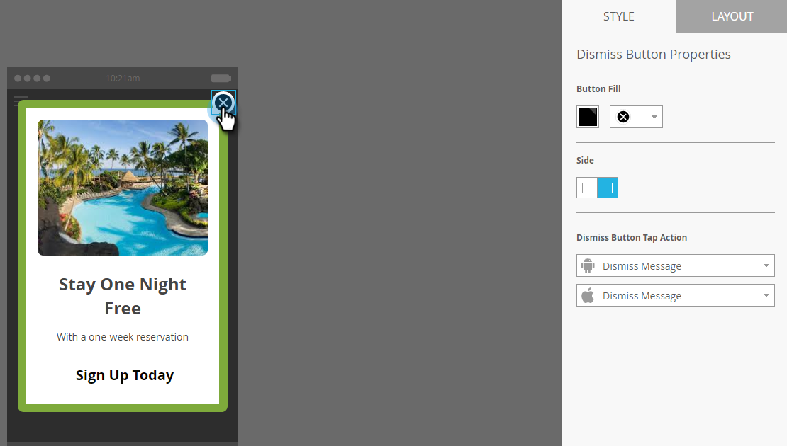

# Einrichten der Schaltfläche &quot;Beenden&quot;und Genehmigen der Nachricht {#set-up-the-dismiss-button-and-approve-the-message}

## Konfigurieren der Eigenschaften der Schaltfläche &quot;Beenden&quot;  {#configure-dismiss-button-properties}

Die Schaltfläche &quot;Beenden&quot;bietet viele Optionen, mit denen Sie sie beliebig konfigurieren können.

1. Klicken Sie im Editor auf die Schaltfläche Schließen .

   

1. Wenn Sie die Schaltflächenfarbe ändern möchten, klicken Sie auf das Farbauswahlquadrat. Wählen Sie eine Farbe aus, indem Sie darauf klicken oder die Hex- oder RGB-Nummer in die Farbauswahl eingeben. Schwarz ist die Standardeinstellung.

   

1. Wählen Sie ein Schaltflächendesign aus der Dropdown-Liste aus. Die Schaltflächen &quot;Rund&quot;enthalten eine volle Farbe und einen Verlauf.

   

   >[!CAUTION]
   >
   >Die Schaltflächenfarbe kann als weißes X auf einem weißen Hintergrund angezeigt werden, wenn Sie ein anderes Design aus der Dropdown-Liste auswählen. Wenn ja, wählen Sie einfach Schwarz oder eine andere Farbe im Farbauswahlquadrat aus, um das weiße X sichtbar zu machen.

1. Sie können auf die Schaltfläche in der linken Ecke klicken, um die Schaltfläche zum Entfernen nach links zu verschieben (standardmäßig rechts).

   

1. Klicken Sie auf das Dropdown-Menü für jede Plattform und wählen Sie für die Schaltfläche Verwerfen eine Tippen-Aktion aus.

   

   >[!NOTE]
   >
   >Sie müssen der Schaltfläche &quot;Verwerfen&quot;eine Tipp-Aktion zuweisen, damit kein Kontrollkästchen aktiviert wird. Nachricht schließen ist die Standardauswahl (und naheliegend).

## Aufziehen {#wrap-it-up}

Alle Auswahlmöglichkeiten für Grafiken, Text und Schaltflächen wurden automatisch gespeichert. Jetzt bist du bereit, die Arbeit zu beenden.

1. Um eine Vorschau Ihrer In-App-Nachricht anzuzeigen, klicken Sie auf das Dropdown-Menü **Nachrichten-Aktionen** und wählen Sie **Vorschau** aus.

   

1. Sehen Sie sich die Vorschau der In-App-Nachricht auf dem Telefon oder Tablet an, um sicherzustellen, dass sie korrekt angezeigt wird.

   

1. Wenn Sie mit der In-App-Nachricht zufrieden sind, klicken Sie auf **Genehmigen und schließen**.

   

   >[!NOTE]
   >
   >Sie können auch **Genehmigen und schließen** direkt aus dem Dropdown-Menü &quot;Nachrichtenaktionen&quot;auswählen (siehe Schritt 1). Warum sollten Sie die Nachricht nicht zuerst in der Vorschau anzeigen, nur um sicher zu sein?

1. Um den Editor zu schließen, ohne ihn zu genehmigen, schließen Sie einfach die Registerkarte . Es wird automatisch gespeichert, sodass Sie es später erneut genehmigen können.

   

So viele Optionen, aber jetzt haben Sie eine großartige In-App-Nachricht, bereit zum Senden!

Jetzt ist es Zeit, [Ihre Nachricht zu senden](/help/marketo/product-docs/mobile-marketing/in-app-messages/sending-your-in-app-message/send-your-in-app-message.md).

>[!MORELIKETHIS]
>
>* [Grundlegendes zu In-App-Nachrichten](/help/marketo/product-docs/mobile-marketing/in-app-messages/understanding-in-app-messages.md)
>* [Layout für Ihre In-App-Nachricht auswählen](/help/marketo/product-docs/mobile-marketing/in-app-messages/creating-in-app-messages/choose-a-layout-for-your-in-app-message.md)
