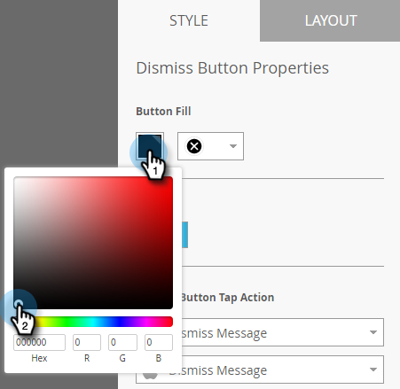

# Einrichten der Schaltfläche &quot;Schließen&quot;und Genehmigen der Nachricht {#set-up-the-dismiss-button-and-approve-the-message}

## Konfigurieren der Schaltflächeneigenschaften  {#configure-dismiss-button-properties}

Die Schaltfläche &quot;Schließen&quot;verfügt über zahlreiche Optionen, mit denen Sie sie nach Ihren Wünschen konfigurieren können.

1. Klicken Sie im Editor auf die Schaltfläche &quot;Schließen&quot;.

   

1. Wenn Sie die Schaltflächenfarbe ändern möchten, klicken Sie auf das Farbauswahlquadrat. Wählen Sie eine Farbe aus, indem Sie darauf klicken oder die Hex- oder RGB-Nummern in der Farbauswahl eingeben. Schwarz ist die Standardeinstellung.

   

1. Wählen Sie einen Schaltflächenentwurf aus der Dropdownliste. Die Schaltflächen &quot;Runde&quot;enthalten eine Vollfarbe und eine Verlaufsoption.

   

   >[!CAUTION]
   >
   >Die Schaltflächenfarbe kann als weißes X auf einem weißen Hintergrund angezeigt werden, wenn Sie ein anderes Design aus der Dropdownliste auswählen. Wenn ja, wählen Sie einfach Schwarz oder eine andere Farbe im Farbauswahlquadrat aus, um das weiße X sichtbar zu machen.

1. Sie können auf die linke Ecke klicken, um die Schaltfläche &quot;Schließen&quot;nach links zu verschieben (standardmäßig rechts).

   

1. Klicken Sie auf die Dropdown-Liste für jede Plattform und wählen Sie eine Tippen-Aktion für die Schaltfläche &quot;Schließen&quot;aus.

   

   >[!NOTE]
   >
   >Sie müssen der Schaltfläche &quot;Abbrechen&quot;eine Tippaktion geben, damit kein Kontrollkästchen aktiviert wird. Die Option &quot;Nachricht schließen&quot;ist die Standardoption (und wird offensichtlich).

## Aufnehmen {#wrap-it-up}

Alle Auswahlen für Grafiken, Text und Schaltflächen wurden automatisch gespeichert. Jetzt bist du bereit, die Arbeit zu beenden.

1. Um Ihre In-App-Nachricht Vorschau, klicken Sie auf die Dropdown-Liste &quot; **Nachrichtenaktionen** &quot;und wählen Sie &quot; **Vorschau**&quot;aus.

   

1. Vorschau der In-App-Nachricht auf Smartphones oder Tablets, um sicherzustellen, dass sie korrekt angezeigt wird.

   

1. Wenn Sie mit der In-App-Nachricht zufrieden sind, klicken Sie auf **Genehmigen und Schließen**.

   

   >[!NOTE]
   >
   >Sie können die Option &quot; **Genehmigen und Schließen** &quot;auch direkt aus der Dropdownliste &quot;Nachrichtenaktionen&quot;wählen (siehe Schritt 1), aber warum wird die Nachricht nicht zuerst Vorschau, nur um sicher zu sein?

1. Um den Editor ohne Genehmigung zu schließen, schließen Sie einfach die Registerkarte. Es wird automatisch gespeichert, sodass Sie es später erneut genehmigen können.

   

So viele Auswahlmöglichkeiten, aber jetzt haben Sie eine großartige In-App-Nachricht, bereit, loszulegen!

Jetzt ist es an der Zeit, deine Nachricht zu [senden](http://docs.marketo.com/display/docs/send+your+in-app+message).

>[!MORELIKETHIS]
>
>* [Informationen zu In-App-Nachrichten](../../../../product-docs/mobile-marketing/in-app-messages/understanding-in-app-messages.md)
>* [In-App-Nachricht senden](http://docs.marketo.com/display/docs/send+your+in-app+message)
>* [Layout für Ihre In-App-Nachricht auswählen](choose-a-layout-for-your-in-app-message.md)

>

