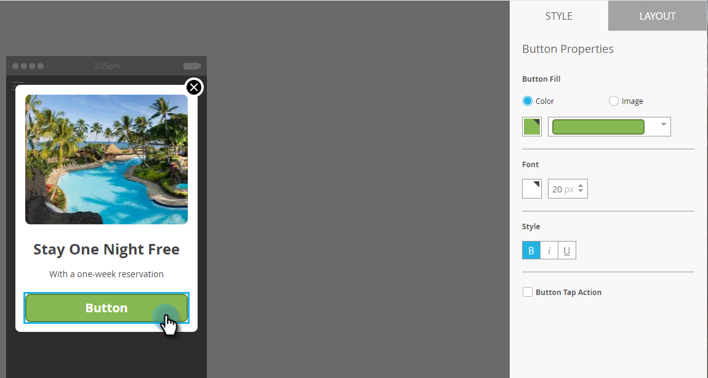

# Einrichten der In-App-Nachrichtenschaltfläche {#set-up-the-in-app-message-button}

Sie können das standardmäßige Schaltflächendesign verwenden, es ändern oder Ihr eigenes benutzerdefiniertes Schaltflächenbild hochladen.

1. Klicken Sie auf die Schaltfläche, um die Registerkarte [!UICONTROL Stil] zur Bearbeitung zu öffnen.

   

1. Um die Farbe für die Standardschaltfläche zu ändern, klicken Sie auf die Schaltfläche **[!UICONTROL Farbe]**.

   

1. Klicken Sie auf das Farbauswahlfeld und wählen Sie die Schaltflächenfarbe aus, indem Sie darauf klicken oder die Hex- oder RGB-Zahlen in der Farbauswahl eingeben.

   

1. Wählen Sie eine Form in der Dropdown-Liste aus. Zu den standardmäßigen Formoptionen gehören scharfe Ecken, runde Ecken und Verläufe.

   

1. Wenn Sie Ihr eigenes Bild für eine Schaltfläche verwenden möchten, klicken Sie auf die Schaltfläche **[!UICONTROL Bild]** und klicken Sie auf **[!UICONTROL Bild auswählen]**.

   

1. Wählen Sie das Bild aus und klicken Sie auf **[!UICONTROL Auswählen]**.

   

   >[!TIP]
   >
   >Wenn Sie ein benutzerdefiniertes Bild für die Schaltfläche platzieren, sollten Sie den darüber gelegten Platzhaltertext entfernen, wenn Ihr Bild bereits Text enthält.

1. Klicken Sie auf das Farbauswahlfeld und wählen Sie dann die Schriftfarbe aus, indem Sie darauf klicken oder im Farbwähler Hex- oder RGB-Zahlen eingeben.

   

1. Klicken Sie auf die Pfeile, um die Schriftgröße auszuwählen.

   

1. Schriftstil für Hervorhebung auswählen: **Fett**, _Kursiv_ oder Unterstreichen.

   

1. Klicken Sie auf den Schaltflächentext, um ihn inline zu bearbeiten.

   

1. Aktivieren Sie das Kontrollkästchen, um die Schaltfläche für die Tipp-Aktion festzulegen.

   

1. Klicken Sie für jede Plattform auf das Dropdown-Menü und wählen Sie eine Tipp-Aktion aus.

   

   >[!NOTE]
   >
   >Die Schaltfläche verfügt immer über eine Tipp-Aktion, sodass das Kontrollkästchen Tipp-Aktion automatisch mit der Standardmeldung „Nachricht [!UICONTROL &quot; ] ist.

Fast da. Der letzte Schritt besteht darin[ „In-App-Nachrichtenhintergrund konfigurieren und Schaltfläche schließen](/help/marketo/product-docs/mobile-marketing/in-app-messages/creating-in-app-messages/set-up-the-in-app-message-background.md).

>[!MORELIKETHIS]
>
>* [Verstehen von In-App-Nachrichten](/help/marketo/product-docs/mobile-marketing/in-app-messages/understanding-in-app-messages.md)
>* [Wählen Sie ein Layout für Ihre [!UICONTROL In-App-Nachricht]](/help/marketo/product-docs/mobile-marketing/in-app-messages/creating-in-app-messages/choose-a-layout-for-your-in-app-message.md)
