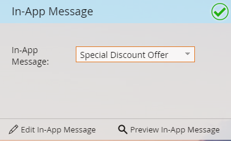

# Auswählen Ihrer In-App-Nachricht {#select-your-in-app-message}

Hier wählen Sie die Nachricht aus, die Sie für das Programm erstellt haben.

1. Wählen Sie Ihre In-App-Nachricht aus der Dropdown-Liste aus.

   

   >[!NOTE]
   >
   >Alle Nachrichten stehen unabhängig von ihrem Wohnort zur Auswahl. Marketo hängt den übergeordneten Namen an jede Datei an, um sicherzustellen, dass jede Datei einen eindeutigen Namen erhält.

1. Nachdem Sie die Nachricht ausgewählt haben, ist sie bereit. Sie können sie bearbeiten oder in der Vorschau anzeigen.

   

   >[!TIP]
   >
   >Um eine andere Nachricht auszuwählen, löschen Sie diese im Feld [!UICONTROL In-App-Nachricht]. Dann wird der [!UICONTROL Neue In-App-Nachricht]-Link erneut angezeigt. Klicken Sie darauf und wählen Sie eine andere Nachricht aus.

Du bist auf dem richtigen Weg. Zeit zum [Planen des Versands](/help/marketo/product-docs/mobile-marketing/in-app-messages/sending-your-in-app-message/schedule-your-in-app-message.md).
