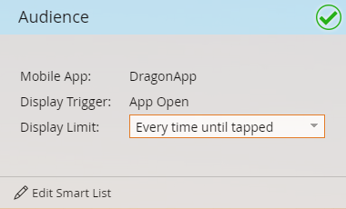

# Festlegen der Audience für In-App-Nachrichten {#set-your-in-app-message-audience}

Der erste Schritt besteht darin, zu entscheiden, wer Ihre In-App-Nachricht erhalten soll. Sie müssen Ihre Smart-Liste einrichten.

1. Klicken Sie **Smart-Liste bearbeiten**.

   

1. In der Smart-Liste wird der Aktivitäts-Trigger „Hat Mobile App“ automatisch ausgefüllt. Klicken Sie auf die Dropdown-Liste und wählen Sie die App aus, in der Sie die Nachricht platzieren möchten.

   

   >[!NOTE]
   >
   >Mehrere Werte für das Feld Mobile App werden derzeit für In-App-Nachrichtenprogramme nicht unterstützt.

1. **App öffnen** ist die Standardeinstellung für die Aktion, Sie können jedoch jedes benutzerdefinierte Ereignis auswählen, das Sie bereits eingerichtet haben.

   

   >[!NOTE]
   >
   >Der Standardcode (App Open) und alle benutzerdefinierten Trigger, die Ihr Trigger dem Code hinzugefügt hat, werden automatisch im Aktionsselektor angezeigt. Wenn ein benutzerdefiniertes Ereignis fehlt, wenden Sie sich an Ihren Entwickler, um sicherzustellen, dass er die benutzerdefinierten Ereignisse zur App hinzugefügt hat. Beachten Sie, dass es einige Zeit dauern kann, bis der Prozess zur benutzerdefinierten Ereigniscodierung und -validierung abgeschlossen ist. Weitere Informationen finden [ in ](/help/marketo/product-docs/mobile-marketing/admin/before-you-create-push-notifications-and-in-app-messages.md) Artikel .

1. Einschränkungen sind für den Trigger **Hat Mobile-App-Aktivität** verfügbar, falls Sie sie benötigen.

   

1. Sie können Ihrer Smart-Liste Filter hinzufügen, um zu begrenzen, wer Ihre In-App-Nachricht erhält. In diesem Beispiel wird mit dem Filter **Akquisitionsdatum** nur Personen, die am 9. Juni 2016 akquiriert wurden, die In-App-Nachricht gesendet.

   

1. Kehren Sie zum Control Panel Ihrer In-App-Nachricht zurück. Legen Sie die Anzeigegrenze in der Dropdown-Liste fest.

   

   >[!NOTE]
   >
   >Das standardmäßige Anzeigelimit ist &quot;**pro Sitzung**. Wenn die Nachricht nicht mehr angezeigt werden soll, nachdem der Empfänger geantwortet hat, wählen Sie **Jedes Mal, bis getippt** aus. Wenn er jedes Mal angezeigt werden soll, egal was der Empfänger tut, wählen Sie &quot;**Mal**.

   

Gut gemacht! Sie haben Ihre Audience eingestellt. Sie haben den blauen Balken und das grüne Häkchen verdient.

Zeit zum [ (wählen Sie Ihre In-App-Nachricht aus](/help/marketo/product-docs/mobile-marketing/in-app-messages/sending-your-in-app-message/select-your-in-app-message.md)!
