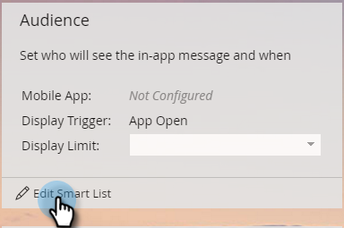

# Zielgruppe für In-App-Nachrichten festlegen {#set-your-in-app-message-audience}

Der erste Schritt besteht darin, zu entscheiden, wer Ihre In-App-Nachricht erhalten soll. Sie müssen Ihre Smart-Liste einrichten.

1. Klicks **Smart List bearbeiten**.

   

1. In der Smart-Liste wird der Trigger Hat Mobile App-Aktivität automatisch ausgefüllt. Klicken Sie auf das Dropdown-Menü und wählen Sie die App aus, in der die Nachricht platziert werden soll.

   

   >[!NOTE]
   >
   >Für In-App-Nachrichtenprogramme werden derzeit keine Werte für das Feld Mobile App unterstützt.

1. **App öffnen** ist die standardmäßige Aktionseinstellung, Sie können jedoch jedes benutzerdefinierte Ereignis auswählen, das Sie bereits eingerichtet haben.

   

   >[!NOTE]
   >
   >Der Standardcode (App-Öffnung) und alle benutzerdefinierten Trigger, die Ihr Entwickler dem Trigger hinzugefügt hat, werden automatisch in der Aktionsauswahl angezeigt. Wenn ein benutzerspezifisches Ereignis fehlt, fragen Sie bei Ihrem Entwickler nach, ob er die benutzerspezifischen Ereignisse zur App hinzugefügt hat. Beachten Sie, dass der Prozess der benutzerdefinierten Ereigniskodierung und -validierung einige Zeit in Anspruch nehmen kann. Siehe [diesem Artikel](/help/marketo/product-docs/mobile-marketing/admin/before-you-create-push-notifications-and-in-app-messages.md) für weitere Informationen.

1. Einschränkungen sind für **Hat Mobile App-Aktivität** Trigger, wenn Sie sie benötigen.

   

1. Sie können Ihrer Smart-Liste Filter hinzufügen, um festzulegen, wer Ihre In-App-Nachricht erhält. In diesem Beispiel wird mithilfe der Variablen **Akquisedatum** gefiltert werden, werden nur Personen, die am 9. Juni 2016 erfasst wurden, die In-App-Nachricht gesendet.

   

1. Kehren Sie zum Control Panel Ihrer In-App-Nachricht zurück. Legen Sie die Anzeigebegrenzung in der Dropdown-Liste fest.

   

   >[!NOTE]
   >
   >Die standardmäßige Anzeigebeschränkung beträgt **Einmal pro Sitzung**. Wenn die Nachricht nach der Antwort des Empfängers nicht mehr angezeigt werden soll, wählen Sie **Jedes Mal, bis**. Wenn es jedes Mal angezeigt werden soll, wählen Sie **Jedes Mal**.

   

Gut gemacht! Du hast dein Publikum eingestellt. Sie haben die blaue Leiste und das grüne Häkchen verdient.

Zeit bis [In-App-Nachricht auswählen](/help/marketo/product-docs/mobile-marketing/in-app-messages/sending-your-in-app-message/select-your-in-app-message.md)!
