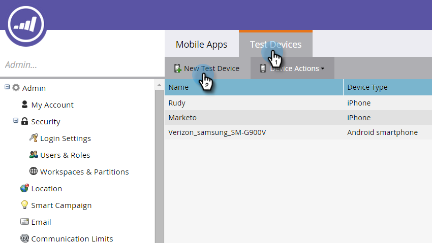
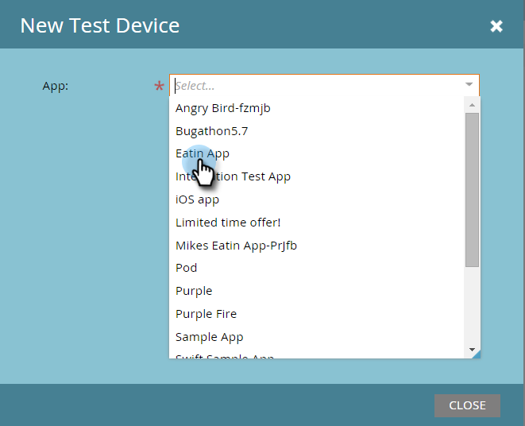
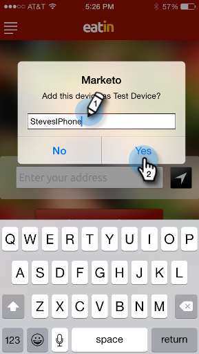

# Hinzufügen eines neuen Testgeräts {#adding-a-new-test-device}

Es ist einfach, ein neues Testgerät hinzuzufügen, um Push-Benachrichtigungen an zu senden.

>[!NOTE]
>
>**Admin-Berechtigungen erforderlich**

1. Klicken Sie auf **[!UICONTROL Admin]** und dann auf den Link **[!UICONTROL Mobile Apps]** .

   

1. Klicken Sie auf die **[!UICONTROL Testgeräte]** und **[!UICONTROL Neues Testgerät]**.

   

1. Wählen Sie Ihre App aus.

   

1. Sie haben zwei Möglichkeiten, Ihr Gerät mit der App zu verbinden.

   Bei der ersten Option kopieren Sie einfach die URL aus dem Feld und senden sie in einer E-Mail oder Textnachricht an Ihr Gerät. Tippen Sie auf dem Gerät auf die URL.

   

   Oder, mit der zweiten Option, klicken Sie auf die zweite Schaltfläche und scannen Sie den QR-Code mit Ihrem Gerät.

   

1. Die App wird geöffnet. Benennen Sie das Gerät und tippen Sie auf **[!UICONTROL Ja]**.

   

   Erfolg!

   

1. Der Status wird aktualisiert und zeigt an, dass das Gerät hinzugefügt wurde. Herzlichen Glückwunsch!

   
