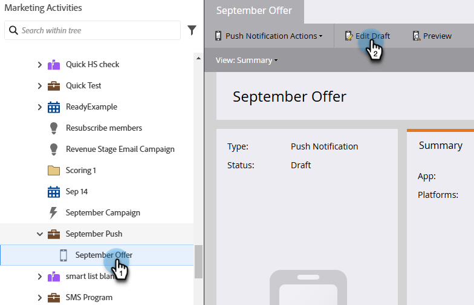
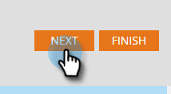

# Konfigurieren einer Push-Benachrichtigung für Mobilgeräte {#configure-mobile-push-notification}

1. Navigieren Sie zum Bereich **[!UICONTROL Marketing-Aktivitäten]**.

   

1. Wählen Sie Ihr Push-Asset aus und klicken Sie auf **[!UICONTROL Entwurf bearbeiten]**.

   

1. Wählen **im** Ihre gewünschte App aus. Android- und Apple-Plattformen sind standardmäßig aktiviert.

   

   >[!NOTE]
   >
   >Wenn Ihre Push-Benachrichtigung nur für eine Plattform gilt (z. B. iOS), können Sie die andere Plattform ausschließen, indem Sie deren Selektor manuell auf &quot;**&quot;**.

1. Klicken Sie auf **[!UICONTROL Weiter]**.

   

1. Geben Sie den Nachrichtentext ein oder wählen Sie das Token-Symbol aus, um Token hinzuzufügen (in diesem Editor sind Token formatiert [wie sie normalerweise sind](/help/marketo/product-docs/demand-generation/landing-pages/personalizing-landing-pages/tokens-overview.md) - Sie können mehrere Token verwenden). Wählen Sie eine **Tipp-Aktion** aus.

   

   >[!NOTE]
   >
   >Wenn eine Plattform aktiviert ist, wird sie auf der linken Seite des Telefonbildschirms angezeigt. Es wird farbig angezeigt, wenn es ausgewählt ist.

   >[!NOTE]
   >
   >Es gibt drei Arten von [!UICONTROL Tipp-Aktionen]:
   >
   >**Launch App** - **Diese App** öffnet die Startseite Ihrer App, wenn auf die Benachrichtigung getippt wird. **Benutzerdefiniert** verwendet einen Deep-Link, um andere Bereiche Ihrer App oder einer anderen App zu öffnen, zu der Sie den Link haben (weitere Informationen finden [&#x200B; unter Deep-Link-](#deep-link-uris)).
   >
   >**[!UICONTROL Landingpage]** - Bringt Sie zu einer bestimmten Marketo-Landingpage.
   >
   >**[!UICONTROL Externe URL]** - Bringt Sie zu einer Landingpage, die nicht zu Marketo gehört.

1. Um einen Deep-Link für eine benutzerdefinierte Tipp-Aktion einzufügen, wählen Sie **Benutzerdefiniert** und geben Sie den [Deep-Link-URI](#deep-link-uris) in das Feld ein.

   

1. Aktivieren Sie für iOS das Kontrollkästchen, um der App mitzuteilen, dass bei Eintreffen der Nachricht ein Ton abgespielt werden soll. Android spielt den Ton automatisch ab.

   

1. Zeigen Sie eine Vorschau der anderen Plattform an und klicken Sie auf **[!UICONTROL Beenden]**.

   

1. Klicken Sie **[!UICONTROL Genehmigen und schließen]**.

   

Die Push-Benachrichtigung kann gesendet werden.

Wenn Sie den Fehler erhalten: `Limited Access: You do not have sufficient privileges to perform this action`, stellen Sie sicher, dass die Berechtigung **Zugriff auf Design Studio** > `Access Landing Page` für den Benutzer festgelegt ist, sowie mindestens eine der folgenden Optionen:

* Push-Benachrichtigung genehmigen
* Push-Benachrichtigung löschen
* Push-Benachrichtigung bearbeiten

## Deep-Link-URIs {#deep-link-uris}

Wenn Abonnentinnen und Abonnenten in einer Push-Nachricht auf eine Schaltfläche klicken, können sie entweder zur Startseite Ihrer App oder direkt zu einer bestimmten Seite innerhalb der App geleitet werden. Ein Deep-Link ist ein eindeutiger Verweis auf eine bestimmte Seite in Ihrer App und sieht einem Website-Link sehr ähnlich.

Ein Deep-Link-URI besteht aus drei Teilen: Schemaname, Pfad und Kennung. Im folgenden Beispiel ist „myappname“ das Schema. Der Pfad lautet „products“ und die Kennung lautet „purple-shirt“. Wenn der Kunde auf tippt, wird er speziell zum lilafarbenen Hemdenartikel auf den Produktseiten Ihrer App weitergeleitet.

Die Deep-Link-Struktur Ihrer App kann sich jedoch vom obigen Beispiel unterscheiden. Ihr Entwickler hat viele Optionen zum Definieren von Deep-Link-URIs. Bitten Sie Ihren Entwickler daher, Ihnen die URIs (Links) für die Seiten zu senden, die Sie verwenden möchten. Dadurch wird sichergestellt, dass die URIs, die Sie in Push-Nachrichten eingeben, an die richtigen Stellen zeigen. Ihr Entwickler kann [weitere Informationen finden Sie hier](https://experienceleague.adobe.com/de/docs/marketo-developer/marketo/mobile/enabling-deep-links-in-your-app).

>[!MORELIKETHIS]
>
>[Mobile Push-Benachrichtigung senden](/help/marketo/product-docs/mobile-marketing/push-notifications/send-a-mobile-push-notification.md)
