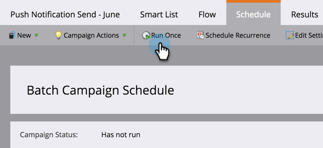
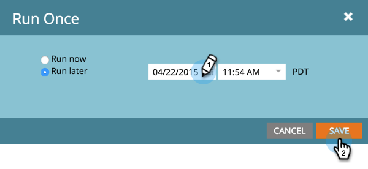

# Senden einer Push-Benachrichtigung für Mobilgeräte {#send-a-mobile-push-notification}

Senden Sie eine Push-Benachrichtigung an Personen, die Ihre Mobile App verwenden.

>[!PREREQUISITES]
>
>* [Erstellen einer neuen intelligenten Kampagne](/help/marketo/product-docs/core-marketo-concepts/smart-campaigns/creating-a-smart-campaign/create-a-new-smart-campaign.md)
>* [Push-Benachrichtigung erstellen](/help/marketo/product-docs/mobile-marketing/push-notifications/create-a-push-notification.md)

1. Navigieren Sie zum Bereich **[!UICONTROL Marketing-Aktivitäten]**.

   

1. Wählen Sie Ihre Smart-Kampagne aus und klicken Sie auf **[!UICONTROL Smart-Liste]**.

   

1. Definieren Sie Ihre Smart-Liste und klicken Sie auf **[!UICONTROL Fluss]**.

   

1. Push-Benachrichtigung auswählen. Klicken Sie auf **[!UICONTROL Zeitplan]**.

   

   >[!NOTE]
   >
   >Die Push-Benachrichtigung muss genehmigt werden, bevor sie in der Dropdown-Liste angezeigt wird.

1. Klicken Sie auf **[!UICONTROL “Einmal ausführen“]**.

   

1. Datum und Uhrzeit wählen. Klicken Sie auf **[!UICONTROL Speichern]**.

   

Lehnen Sie sich zurück und warten Sie, bis Ihre Push-Benachrichtigung erlischt.
