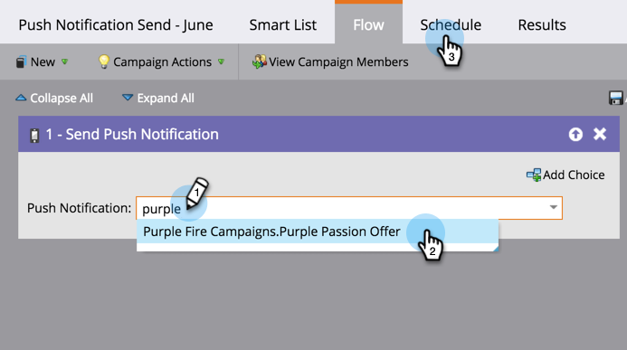

# Mobile Push-Benachrichtigung senden {#send-a-mobile-push-notification}

Senden Sie eine Push-Benachrichtigung an Personen, die Ihre mobile App verwenden.

>[!PREREQUISITES]
>
>* [Erstellen einer neuen Smart-Kampagne](/help/marketo/product-docs/core-marketo-concepts/smart-campaigns/creating-a-smart-campaign/create-a-new-smart-campaign.md)
>* [Push-Benachrichtigung erstellen](/help/marketo/product-docs/mobile-marketing/push-notifications/create-a-push-notification.md)

1. Navigieren Sie zu **Marketingaktivitäten** Bereich.

   

1. Wählen Sie Ihre Smart-Kampagne aus und klicken Sie auf **Smart List**.

   

1. Definieren Sie Ihre Smart-Liste und klicken Sie auf **Fluss**.

   

1. Wählen Sie eine Push-Benachrichtigung. Klicks **Zeitplan**.

   

   >[!NOTE]
   >
   >Die Push-Benachrichtigung muss genehmigt werden, bevor sie in der Dropdown-Liste angezeigt wird.

1. Klicken Sie auf **“Einmal ausführen“**.

   

1. Wählen Sie ein Datum und eine Uhrzeit. Klicks **Speichern**.

   

Setzen Sie sich zurück und warten Sie, bis Ihre Push-Benachrichtigung gesendet wird.
