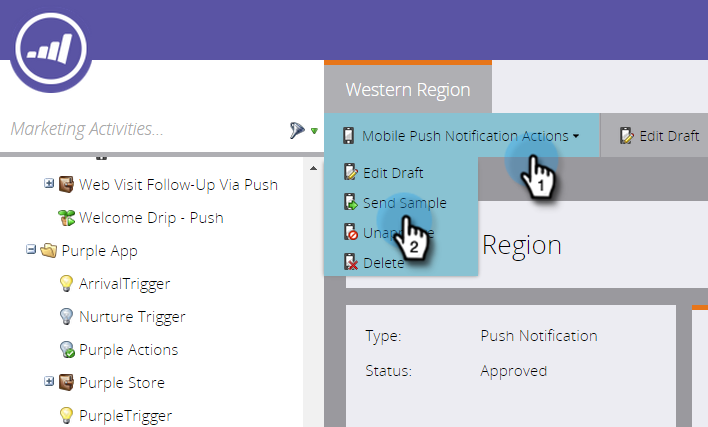

# Senden einer Beispiel-Push-Benachrichtigung {#send-a-push-notification-sample}

Sie können ein Beispiel senden, um zu überprüfen, ob Ihre Push-Benachrichtigung ordnungsgemäß funktioniert!

>[!PREREQUISITES]
>
>Stellen Sie sicher, dass die App auf dem Gerät installiert ist, an das Sie das Beispiel senden.

1. Sie können ein Beispiel auf drei Arten senden:

   Klicken Sie in der Baumstruktur links mit der rechten Maustaste auf das Push-Benachrichtigungs-Asset und dann auf **[!UICONTROL Beispiel senden]**.

   

   Oder klicken Sie im Menü Push-Benachrichtigungsaktionen auf **[!UICONTROL Beispiel senden]**.

   

   Oder klicken Sie im Editor für Push-Benachrichtigungen auf **[!UICONTROL Beispiel senden]**.

   

1. Wenn Sie das zu verwendende Testgerät bereits eingerichtet haben, wählen Sie es einfach aus der Liste aus.

   

   Oder klicken Sie auf **[!UICONTROL Gerät hinzufügen]**, um [ein neues Testgerät hinzuzufügen](/help/marketo/product-docs/mobile-marketing/push-notifications/adding-a-new-test-device.md) um die Stichprobe an zu senden.

   

1. Sie haben zwei Möglichkeiten, Ihr Gerät mit der App zu verbinden.

   Klicken Sie bei der ersten Option auf die Schaltfläche **[!UICONTROL URL mit Gerät]**, kopieren Sie die URL aus dem Feld und senden Sie sie in einer E-Mail oder Textnachricht an Ihr Gerät. Tippen Sie auf dem Gerät auf die URL. Wenn der Status die Verbindung anzeigt, klicken Sie auf **[!UICONTROL Senden]**.

   

   Oder klicken Sie mit der zweiten Option auf die Schaltfläche **[!UICONTROL QR-Code mit Gerät]** und scannen Sie den QR-Code mit Ihrem Gerät. Wenn der Status die Verbindung anzeigt, klicken Sie auf **[!UICONTROL Senden]**.

   

   >[!TIP]
   >
   >Sie haben ein Testgerät erfolgreich hinzugefügt, es wird jedoch nicht im Feld **[!UICONTROL Senden an]** angezeigt? Überprüfen Sie diese zur Fehlerbehebung:
   >
   >* Push-Benachrichtigungen sind für die App aktiviert, die mit der Push-Benachrichtigung verknüpft ist.
   >
   >* Die Push-Benachrichtigung ist für die Plattform Ihres Testgeräts konfiguriert. Wenn Sie beispielsweise gerade eine iPhone als Testgerät hinzugefügt haben, stellen Sie sicher, dass die Push-Benachrichtigung für iOS aktiviert ist.

Einfach!
