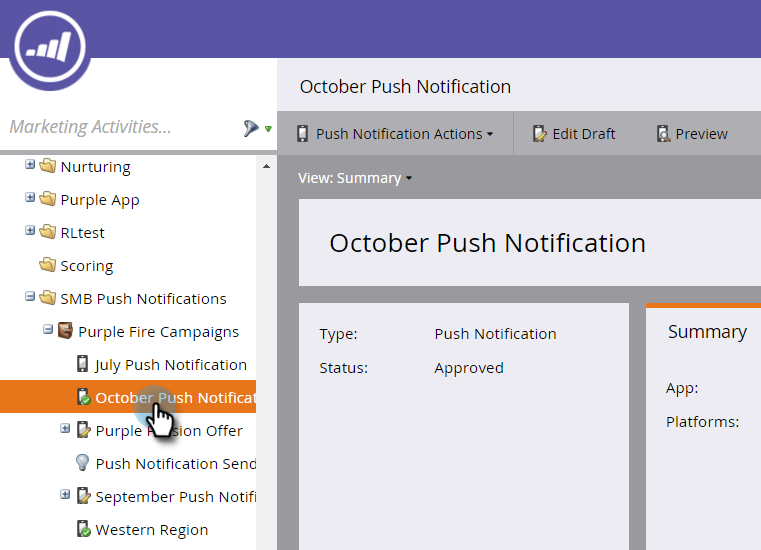

# Anzeigen des Dashboards für Push-Benachrichtigungen {#view-the-push-notification-dashboard}

Es ist einfach zu sehen, wie Ihre Push-Benachrichtigungen funktionieren.

1. Navigieren Sie zum Bereich **[!UICONTROL Marketing-Aktivitäten]**.

   

1. Wählen Sie Ihre Kampagne aus.

   

1. Klicken Sie auf **[!UICONTROL Anzeigen: Zusammenfassung]** und wählen Sie **[!UICONTROL Dashboard]**.

   

1. Sie können die Diagramme [!UICONTROL Insgesamt gesendet] und [!UICONTROL Total Taps] für iOS und Android in Kreisdiagrammen anzeigen. Scrollen Sie nach unten, um [!UICONTROL Tippen Sie auf &#x200B;] in Balkendiagrammen zu sehen.

   

   >[!NOTE]
   >
   >Die Metrik _Gesendet_ spiegelt möglicherweise mehr Sendungen wider als die genaue Anzahl der Personen, an die die Push-Benachrichtigung gesendet wurde. Das liegt daran, dass die Berechnung auf der Grundlage der _Anzahl der Geräte_ erfolgt, die für den Empfang Ihrer Push-Benachrichtigung qualifiziert sind. Wenn beispielsweise eine Person über drei Geräte verfügt, registriert das Dashboard drei Sendungen und nicht einen.

   >[!MORELIKETHIS]
   >
   >* [Push-Benachrichtigungen verstehen](/help/marketo/product-docs/mobile-marketing/push-notifications/understanding-push-notifications.md)
   >* [Mobile Push-Benachrichtigung senden](/help/marketo/product-docs/mobile-marketing/push-notifications/send-a-mobile-push-notification.md)
