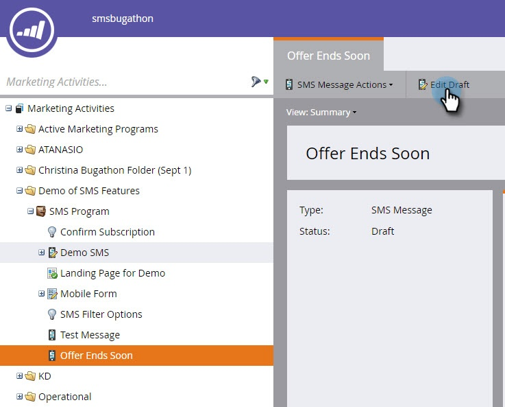

# Erstellen einer Video-SMS {#create-a-vibes-sms-message}

So erstellen Sie eine Vibes-SMS-Nachricht:

>[!AVAILABILITY]
>
>Diese Funktion ist als Add-on für Ihr Adobe Marketo Engage-Konto verfügbar. Damit sie ordnungsgemäß bereitgestellt werden kann, muss sie über Adobe erworben werden. Weitere Informationen erhalten Sie vom Adobe Account Team (Ihrem Kundenbetreuer).

1. Navigieren Sie zu **Marketingaktivitäten**.

   

1. Klicken Sie mit der rechten Maustaste auf ein Programm und wählen Sie **Neues lokales Asset**.

   

1. Klicks **Neues lokales Asset**.

   

   >[!TIP]
   >
   >Alternativ können Sie auf die **Neu** angezeigt.

1. Klicks **SMS-Nachricht**.

   

1. Geben Sie einen Namen und eine optionale Beschreibung für die neue SMS-Nachricht ein und klicken Sie auf **Erstellen**.

   

1. Klicks **Entwurf bearbeiten**.

   

1. Klicken Sie im Nachrichteneditor in die blaue Blase und beginnen Sie mit der Texteingabe.

   

   >[!NOTE]
   >
   >Die Beschränkungen für die USA und Kanada unterscheiden sich bei 160 bzw. 130 Zeichen. Wenn Sie diese Zeichenbeschränkungen überschreiten, kann Ihre Nachricht aufgeteilt werden. Während wir anzeigen, wenn Sie die kanadische Grenze überschreiten, ist der Editor für die USA optimiert und teilt die Nachricht auf der Grundlage der US-Grenze auf.

1. Klicks **Token** im Menü Einfügen , um Ihrer Nachricht ein Token hinzuzufügen.

   

   >[!NOTE]
   >
   >Durch das Hinzufügen eines Tokens kann die Nachricht u. U. die erlaubte Zeichenanzahl überschreiten. Die Nachricht wird dann aufgeteilt, was zu zusätzlichen Gebühren führt.

1. Klicks **Link** im Menü Einfügen , um Ihrer Nachricht einen Link hinzuzufügen.

   

1. Wählen Sie einen Link-Typ aus. Marketo-Landingpage ist die Standardeinstellung. Wenn Sie damit fertig sind, müssen Sie die Landingpage aus der Dropdown-Liste auswählen und auf **Einfügen**.

   

   >[!NOTE]
   >
   >Die beiden Tracking-Links sind standardmäßig ausgewählt.

1. Wenn Sie stattdessen eine externe URL verwenden möchten, klicken Sie auf die **Externe URL** und geben Sie die URL in das Feld URL ein. Klicken Sie auf **Einfügen**.

   

1. Der Link wird in der Nachricht angezeigt.

   

   >[!NOTE]
   >
   >Marketo zeigt eine Link-Vorschau der Marken-Tracking-Domäne an. Wenn Sie das Kontrollkästchen &quot;mkt_tok&quot;-Link deaktivieren, wird der Link geändert. Deaktivieren Sie auch das Kontrollkästchen Link verfolgen , und die URL wird auf die Standardlänge gekürzt (z. B. www.mygooglepage.com).

   

   >[!NOTE]
   >
   >Die Zeichenzahl spiegelt nur die Zeichen wider, die in der niedrigsten Nachricht enthalten sind.

Wenn Sie mehr als die US-Grenze einfügen, unterteilt der Editor Ihre Nachricht in Abschnitte. Es gibt eine absolute Gesamtbeschränkung von 900 Zeichen. Nach Erreichen dieses Grenzwerts wird die Nachricht beim Versand an die Audience automatisch abgeschnitten.
