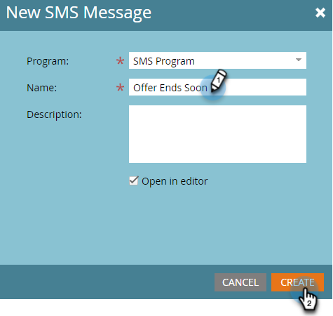
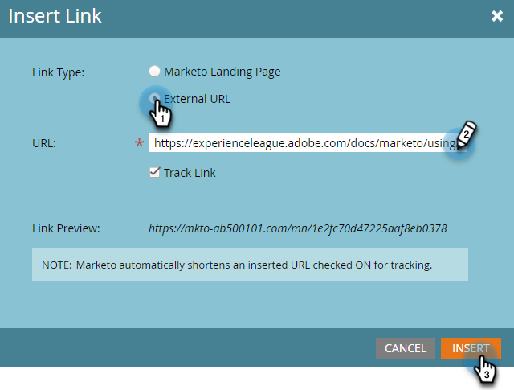

# Erstellen einer SMS-Nachricht {#create-an-sms-message}

So erstellen Sie eine SMS-Nachricht.

>[!AVAILABILITY]
>
>Diese Funktion ist als Add-on für Ihr Adobe Marketo Engage-Konto verfügbar. Damit sie ordnungsgemäß bereitgestellt werden kann, muss sie über Adobe erworben werden. Weitere Informationen erhalten Sie beim Adobe Account Team (Ihrem Account Manager). Die native Integration von Marketo Vibes SMS ist in den USA und Kanada verfügbar. Für andere Länder kann eine Verbindung über Marketo Webhooks genutzt werden, indem man sich [direkt an Vibes](https://www.vibes.com/talk-to-sales).

>[!PREREQUISITES]
>
>[Hinzufügen von Vibes als LaunchPoint-Service](/help/marketo/product-docs/mobile-marketing/admin/add-vibes-as-a-launchpoint-service.md){target="_blank"}

1. Navigieren Sie **[!UICONTROL Marketing-Aktivitäten]**.

   

1. Klicken Sie mit der rechten Maustaste auf das gewünschte Programm und wählen Sie **[!UICONTROL Neues lokales Asset]**.

   

1. Wählen Sie **SMS-Nachricht** aus.

   

1. Geben Sie einen Namen und eine optionale Beschreibung für die neue SMS-Nachricht ein und klicken Sie auf **Erstellen**.

   

1. Klicken Sie im Editor in die blaue Blase und geben Sie Text ein.

   

   >[!NOTE]
   >
   >Die Zeichenbeschränkung für eine SMS-Nachricht beträgt 160 Zeichen, wenn der standardmäßige ASCII-Zeichensatz verwendet wird. Wenn Sie mehr als 160 Zeichen verwenden, wird Ihre Nachricht auf der Grundlage der Gesamtanzahl der Zeichen aufgeteilt.

1. Um ein Token zu Ihrer Nachricht hinzuzufügen, schreiben Sie eine kurze Begrüßung und klicken Sie auf **Token**.

   

   >[!NOTE]
   >
   >Durch das Hinzufügen eines Tokens kann die Nachricht u. U. die erlaubte Zeichenanzahl überschreiten. Die Nachricht wird dann aufgeteilt und es wird eine zusätzliche Nachricht erstellt.

   >[!IMPORTANT]
   >
   >SMS-Konformität: Alle ausgehenden SMS-Nachrichten müssen den Markennamen oder die Programmbeschreibung enthalten. HELP- und STOP-Anweisungen sollten für wiederkehrende Nachrichtenprogramme mindestens einmal monatlich pro Abonnent bereitgestellt werden.

1. Wählen Sie das gewünschte **Token** aus, geben Sie einen optionalen **Standardwert** ein und klicken Sie auf **Erstellen**.

   

1. Um einen Link hinzuzufügen, wählen Sie in der Nachricht aus, wo er angezeigt werden soll, und klicken Sie auf **Link**.

   

1. Link-Typ auswählen. Marketo-Landingpage ist die Standardeinstellung. Klicken Sie anschließend auf das Dropdown-Menü Landingpage und wählen Sie die gewünschte Seite aus. Klicken Sie **Einfügen** wenn Sie fertig sind.

   

   >[!NOTE]
   >
   >Die beiden Tracking-Links sind standardmäßig ausgewählt. Wenn Sie Einschließen nur aktivieren, kann der Link weiterhin verfolgt werden, aber nach der Umleitung enthält die Ziel-URL den Abfragezeichenfolgenparameter mkt_tok nicht. Dieser Parameter wird von Marketo Landing Pages und Munchkin verwendet, um eine ordnungsgemäße Verfolgung von Personenaktivitäten sicherzustellen (z. B. wenn eine Person sich abmeldet).

1. Wenn Sie stattdessen eine externe URL verwenden möchten, wählen Sie **Externe URL** aus, geben Sie die URL ein/fügen Sie sie ein und klicken Sie auf **Einfügen**.

   

   >[!NOTE]
   >
   >Wenn „Link verfolgen“ ausgewählt bleibt, ändert Marketo die URL zu Tracking-Zwecken automatisch. Wenn Sie das Tracking deaktivieren, wird die URL in der Nachricht unverändert angezeigt (z. B. `www.adobe.com`).

   >[!CAUTION]
   >
   >Es wird empfohlen _URL-_ (z. B. Bitly) nicht zu verwenden, da die Provider Ihre Nachricht möglicherweise als Spam kennzeichnen können.

1. Der Link wird in der Nachricht angezeigt.

   

   >[!NOTE]
   >
   >Marketo zeigt eine Link-Vorschau der Marken-Tracking-Domain an. Wenn Sie das Kontrollkästchen mkt_tok link deaktivieren, wird der Link geändert.

Wenn Sie mehr als 160 Zeichen einfügen, unterteilt der Editor Ihre SMS in Abschnitte. Pro Nachricht sind maximal 900 Zeichen zulässig. Wenn Sie diesen Wert überschreiten, wird die Nachricht beim Versand abgeschnitten.
