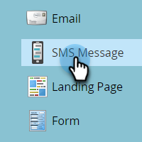
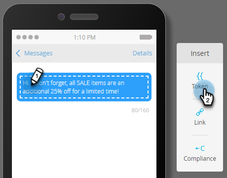

# SMS erstellen {#create-an-sms-message}

So erstellen Sie eine SMS-Nachricht:

>[!AVAILABILITY]
>
>Diese Funktion ist als Add-on für Ihr Adobe Marketo Engage-Konto verfügbar. Damit sie ordnungsgemäß bereitgestellt werden kann, muss sie über Adobe erworben werden. Weitere Informationen erhalten Sie vom Adobe Account Team (Ihrem Kundenbetreuer). Die native Integration von Marketo Vibes SMS ist in den USA und Kanada verfügbar. Für andere Länder kann eine Verbindung über Marketo Webhooks verwendet werden, indem [Vibes direkt kontaktieren](https://www.vibes.com/talk-to-sales).

>[!PREREQUISITES]
>
>[Hinzufügen von Ansichten als LaunchPoint-Dienst](/help/marketo/product-docs/mobile-marketing/admin/add-vibes-as-a-launchpoint-service.md){target="_blank"}

1. Wechseln Sie zu **[!UICONTROL Marketingaktivitäten]**.

   

1. Klicken Sie mit der rechten Maustaste auf das gewünschte Programm und wählen Sie **[!UICONTROL Neues lokales Asset]** aus.

   

1. Wählen Sie **SMS-Nachricht** aus.

   

1. Geben Sie einen Namen und eine optionale Beschreibung für die neue SMS-Nachricht ein und klicken Sie auf **Erstellen**.

   

1. Klicken Sie im Editor in die blaue Blase und beginnen Sie mit der Texteingabe.

   

   >[!NOTE]
   >
   >Die Zeichenbeschränkung für eine SMS-Nachricht beträgt 160 Zeichen, die dem standardmäßigen ASCII-Zeichensatz entsprechen. Bei mehr als 160 Zeichen wird die Nachricht auf der Grundlage der Gesamtzahl der Zeichen aufgeteilt.

1. Um Ihrer Nachricht ein Token hinzuzufügen, schreiben Sie eine schnelle Begrüßung und klicken Sie auf **Token**.

   

   >[!NOTE]
   >
   >Durch das Hinzufügen eines Tokens kann die Nachricht u. U. die erlaubte Zeichenanzahl überschreiten. Die Nachricht wurde dann aufgeteilt und eine zusätzliche Nachricht erstellt.

   >[!IMPORTANT]
   >
   >SMS-Kompatibilität: Alle ausgehenden SMS-Nachrichten müssen den Namen der Marke oder die Beschreibung des Programms enthalten. HILFE- und STOP-Anweisungen sollten mindestens einmal monatlich pro Abonnent für wiederkehrende Nachrichtenprogramme bereitgestellt werden.

1. Wählen Sie den gewünschten **Token** aus, geben Sie einen optionalen **Standardwert** ein und klicken Sie auf **Erstellen**.

   

1. Um einen Link hinzuzufügen, wählen Sie aus, wo in der Nachricht der Link angezeigt werden soll, und klicken Sie auf **Link**.

   

1. Wählen Sie einen Link-Typ aus. Marketo-Landingpage ist die Standardeinstellung. Wenn Sie damit fertig sind, klicken Sie auf das Dropdown-Menü Landingpage und wählen Sie die gewünschte Seite aus. Klicken Sie abschließend auf **Einfügen** .

   

   >[!NOTE]
   >
   >Die beiden Tracking-Links sind standardmäßig ausgewählt. Wenn Sie die Option Nur mkt_tok einschließen deaktivieren, kann der Link weiterhin verfolgt werden. Nach der Umleitung enthält die Ziel-URL jedoch nicht den Abfragezeichenfolgenparameter mkt_tok. Dieser Parameter wird von Marketo-Einstiegsseiten und Munchkin verwendet, um eine ordnungsgemäße Verfolgung der Personenaktivitäten sicherzustellen (z. B. wenn sich eine Person abmeldet).

1. Wenn Sie stattdessen eine externe URL verwenden möchten, wählen Sie **Externe URL**, geben Sie die URL ein/fügen Sie sie ein und klicken Sie auf **Einfügen**.

   

   >[!NOTE]
   >
   >Wenn Sie die Option &quot;Link verfolgen&quot;beibehalten, ändert Marketo die URL automatisch zu Tracking-Zwecken. Wenn Sie das Tracking deaktivieren, wird die URL unverändert in der Nachricht angezeigt (z. B. `www.adobe.com`).

   >[!CAUTION]
   >
   >Es wird empfohlen, _nicht_ URL-Shorteners zu verwenden (z. B. Bitly), da die Provider Ihre Nachricht als Spam kennzeichnen können.

1. Der Link wird in der Nachricht angezeigt.

   

   >[!NOTE]
   >
   >Marketo zeigt eine Link-Vorschau der Marken-Tracking-Domäne an. Wenn Sie das Kontrollkästchen &quot;mkt_tok&quot;-Link deaktivieren, wird der Link geändert.

Wenn Sie mehr als 160 Zeichen einfügen, unterteilt der Editor Ihre SMS in Abschnitte. Es gibt eine Gesamtbeschränkung von 900 Zeichen pro Nachricht. Wenn Sie diese Anzahl überschreiten, wird die Nachricht beim Versand abgeschnitten.
