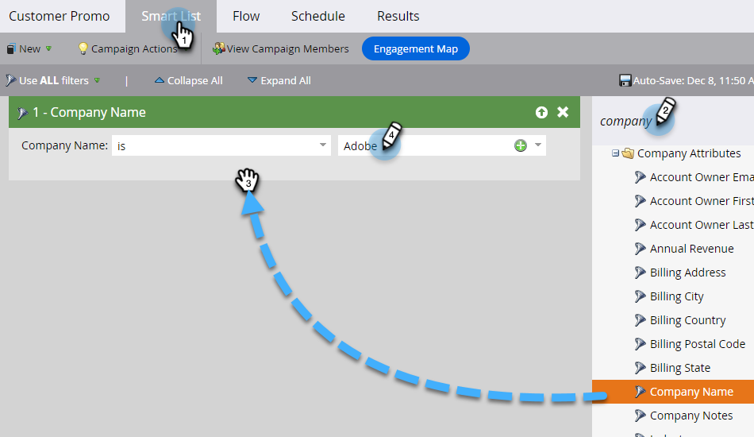

# SMS-Nachricht senden {#send-a-vibes-sms-message}

Du hast [SMS erstellt haben](/help/marketo/product-docs/mobile-marketing/vibes-sms-messages/create-an-sms-message.md){target="_blank"}, jetzt ist es Zeit, es zu senden. Sie können sie über Batch oder Trigger Campaign versenden.

>[!NOTE]
>
>Beim Senden von SMS-Nachrichten:
>
>* Marketo Engage dedupliziert nach Telefonnummer. Wenn also mehrere Personen über dieselbe Telefonnummer verfügen, erhält nur eine Person die Nachricht, wenn sie nur einer Vibes-Abonnementliste angehört. Die Deduplizierung erfolgt auf der Ebene der Vibes-Abonnement-Liste, nicht auf der Programmebene von Marketo.
>* Marketo sendet keine Nachrichten an Personen, die auf die Blockierungsliste gesetzt oder Marketing ausgesetzt sind.
>* Eine SMS-Nachricht wird an niemanden gesendet, der sich abgemeldet hat, wenn er nicht in der Liste der mobilen Vibes-Datenbank aufgeführt ist.

## Senden einer Batch-SMS {#send-a-batch-sms}

1. Klicken Sie in My Marketo auf **Marketingaktivitäten**.

   

1. Wählen Sie die gewünschte Smart-Kampagne aus.

   

1. Klicken Sie auf **Smart List** und definieren Sie die Audience für die SMS. In diesem Beispiel senden wir an alle Benutzer in unserer Datenbank, deren Firma &quot;Adobe&quot;ist.

   

1. Im **Fluss** Registerkarte, ziehen **SMS-Nachricht senden**. Wählen Sie aus den Dropdown-Listen die gewünschte Liste für SMS-Nachrichten und Besuche aus.

   

   >[!NOTE]
   >
   >Der Wähler &quot;Besuchsliste&quot;dient als weiterer Filter für die bereits in der Smart-Liste identifizierte Zielgruppe, sodass nur Personen in die Liste aufgenommen werden, die zu dieser Vibes-Liste gehören.

1. Klicken Sie auf **Zeitplan** und planen Sie Ihre SMS.

   

## Trigger-SMS senden {#send-a-trigger-sms}

1. Klicken Sie in My Marketo auf **Marketingaktivitäten**.

   

1. Wählen Sie die gewünschte Smart-Kampagne aus.

   

1. Klicken Sie auf **Smart List** wählen Sie den gewünschten Trigger aus und legen Sie dessen Wert fest. In diesem Beispiel verwenden wir **Formular ausfüllen**.

   

1. Im **Fluss** Registerkarte, ziehen **SMS-Nachricht senden**. Wählen Sie aus den Dropdown-Listen die gewünschte Liste für SMS-Nachrichten und Besuche aus.

   

   >[!NOTE]
   >
   >Der Wähler &quot;Besuchsliste&quot;dient als weiterer Filter für die bereits in der Smart-Liste identifizierte Zielgruppe, sodass nur Personen in die Liste aufgenommen werden, die zu dieser Vibes-Liste gehören.

1. Klicken Sie auf **Zeitplan** tab, dann **Aktivieren**.

   

>[!MORELIKETHIS]
>
>* [Erstellen einer Vibes-Nachricht](/help/marketo/product-docs/mobile-marketing/vibes-sms-messages/create-a-vibes-sms-message.md){target="_blank"}
>* [Verwenden von SMS-Optionen in einer Smart-Kampagne](/help/marketo/product-docs/mobile-marketing/vibes-sms-messages/using-sms-options-in-a-smart-campaign.md){target="_blank"}
