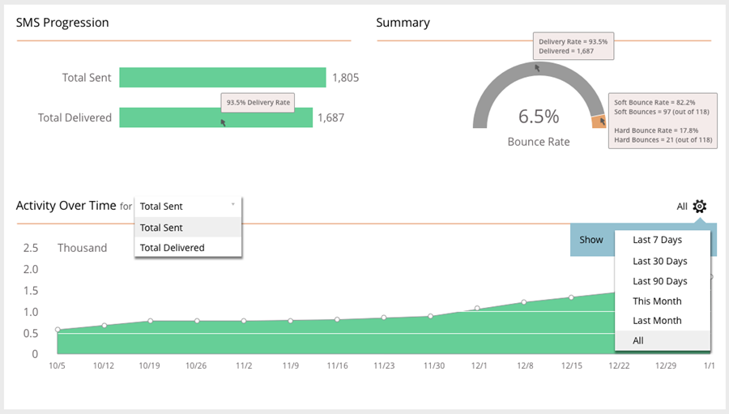

# SMS-Berichterstellung {#sms-reporting}

Das SMS-Nachrichten-Dashboard bietet nützliche Analysen zu Ihren Nachrichten.

## Zugriff auf das Dashboard {#access-the-dashboard}

1. Um die Berichte anzuzeigen, wählen Sie die gewünschte SMS-Nachricht aus. Klicken Sie auf **Ansicht** und wählen Sie **Dashboard**.

   

1. Das Dashboard wird angezeigt.

   

## Dashboard-Übersicht {#dashboard-overview}

### SMS-Entwicklung {#sms-progression}

Zeigt die Gesamtzahl der gesendeten und zugestellten Nachrichten an. Die Beträge werden rechts angezeigt. Wenn Sie den Mauszeiger über einen Balken bewegen, wird der Prozentsatz angezeigt.

### Zusammenfassung {#summary}

Zeigt die berechnete Absprungrate in Prozent. Bewegen Sie den Mauszeiger über die Symbolleiste, um die Versandrate nach Betrag und Prozentsatz anzuzeigen. Bewegen Sie den Mauszeiger über den orangefarbenen Abschnitt Absprungrate des Balkens, um die Beträge/Prozentsätze der Soft- und Hardbounce-Rate anzuzeigen.

### Aktivität im Zeitablauf {#activity-over-time}

Ermöglicht die Auswahl von Insgesamt gesendet oder Zugestellt. Wählen Sie einen geeigneten Bereich aus der Datumsbereichsauswahl aus.

